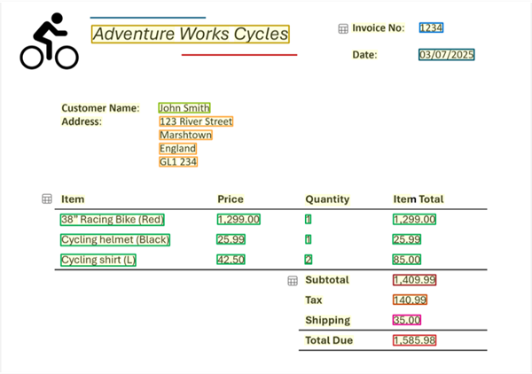
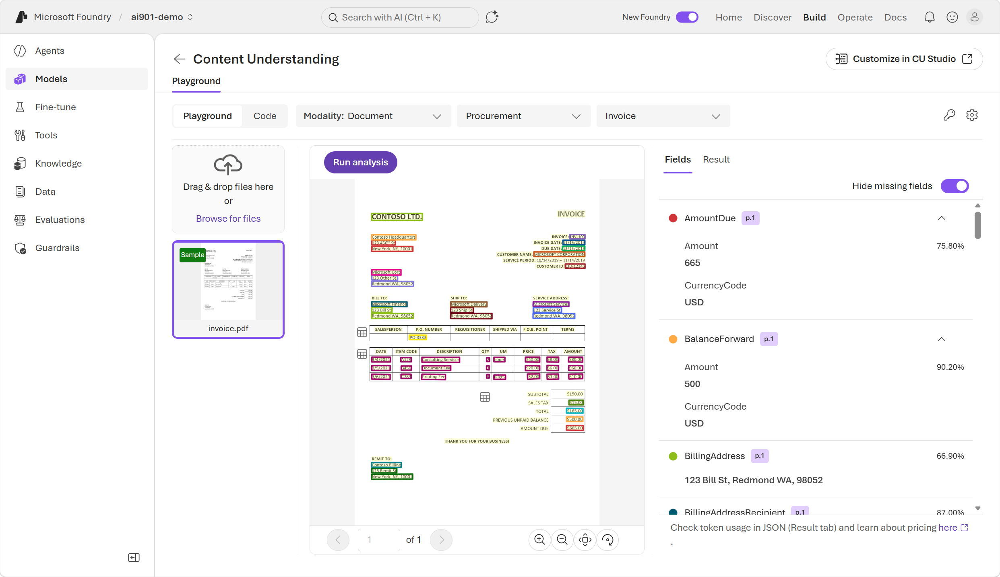
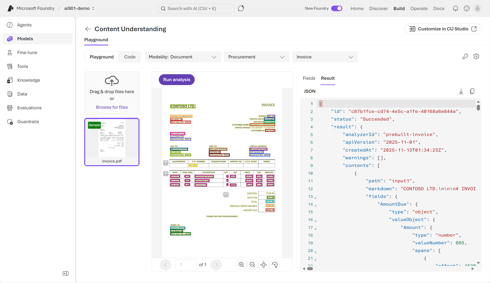
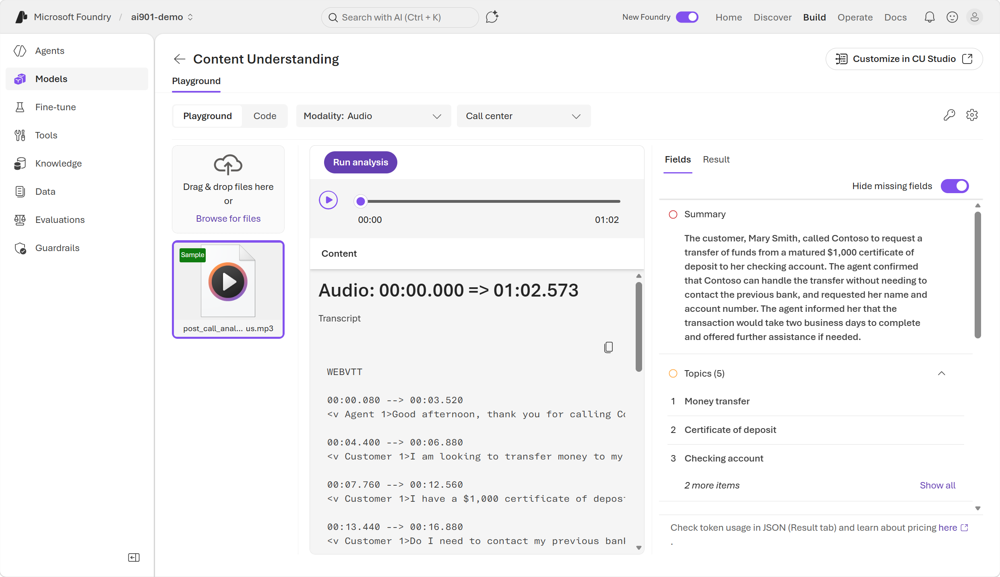
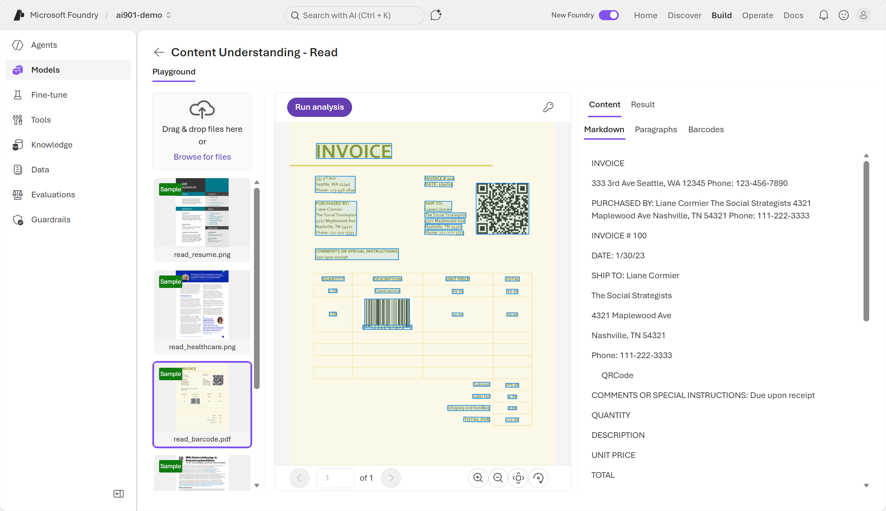
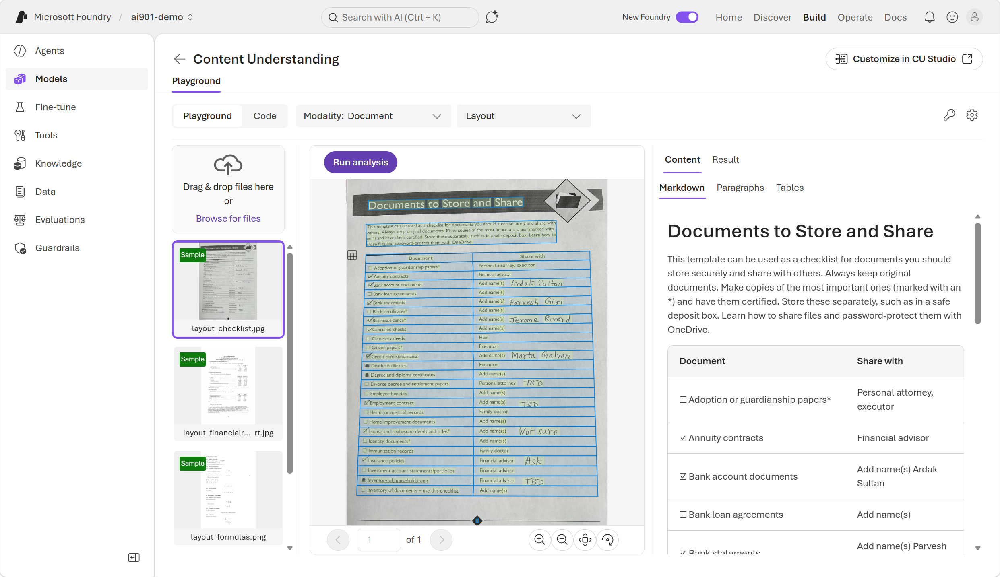
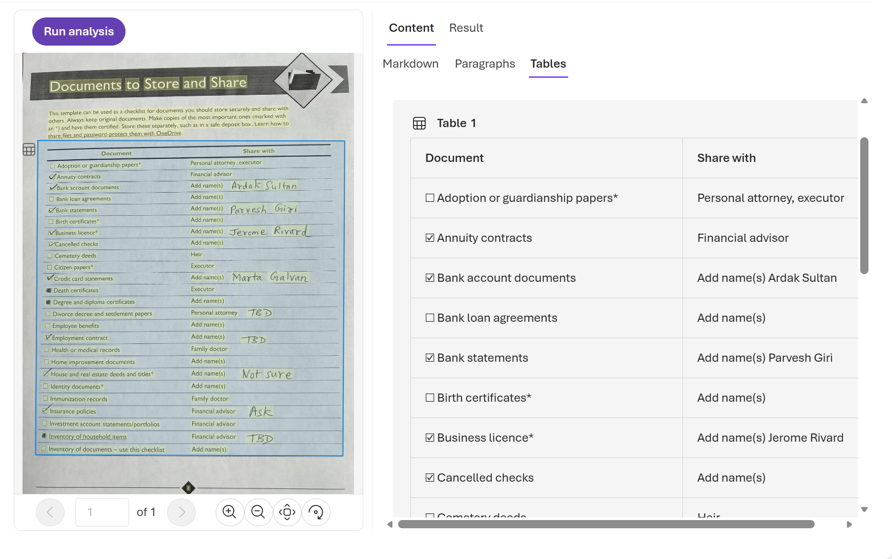

### **Get Started With AI Information Extraction:-**

Azure Content Understanding extracts structured data from unstructured content (documents, audio, video) so applications can search, analyze, and act on information automatically. 

**Core Facts**

1. Purpose: turn unstructured content into machine‑readable, structured information (entities, fields, relationships). 

2. Supported content types: documents & images, audio, and video. 

3. Typical outcomes: extracted fields (amounts, dates), recognized entities, searchable metadata, and structured records for downstream workflows. 

**Examples of information extraction scenarios include:**

1. Expense claim processing: A company needs to extract expense descriptions and amounts from scanned receipts.

2. Customer support: An agency needs to analyze recorded support calls to identify common problems and resolutions.

3. Capacity planning: A tourist organization needs to estimate visitor volumes by analyzing video footage and images.

#### **Schema Driven Extraction**

You define a schema (fields and nested structure) so the analyzer returns named fields (e.g., VendorName, InvoiceDate, Items) rather than raw text. 

The schema-driven approach is what differentiates Azure Content Understanding from basic OCR or transcription services. 

Identifying structured fields allows Azure Content Understanding to understand relationships between values, something OCR alone cannot do. Schemas are applied semantically, meaning Fields can be extracted even if labels differ and Fields can be extracted even if labels are missing

example:- Invoice No., Invoice #, or an unlabeled number can all map to InvoiceNumber if the analyzer determines they represent the same concept.

A schema describes what information you want to extract and how that information should be structured. 

example of an invoice schema:-

<code>

    Vendor name
    Invoice number
    Invoice date
    Customer name
    Custom address
    Items - the items ordered, each of which includes:
        Item description
        Unit price
        Quantity ordered
        Line item total
    Invoice subtotal
    Tax
    Shipping Charge
    Invoice total
</code>

Sample image of an invoice analyzed and mapped to schema

#### **Understanding Analyser**

An analyzer is a reusable units that apply a schema to content and produce consistent, predictable JSON outputs. Use prebuilt analyzers or create custom ones. 

Azure Content Understanding offers prebuilt analyzers for common scenarios and supports custom analyzers tailored to your needs. At a high level:

    1. You choose or create an analyzer.
    2. The analyzer includes a schema defining fields and structure.
    3. You submit content for analysis
    4. The service applies the schema
    5. You receive structured JSON results matching the schema

#### **Using Azure Content Understanding in the Foundry portal**

After you create a Microsoft Foundry resource, you can use the new Foundry portal interface to test out Azure Content Understanding.

Azure Content Understanding's analyzers identify text values in documents and map them to specific fields. In Foundry portal, you can also view the JSON results of the processing.

#### **Building Client Side Application**

You can use the Content Understanding API to build a lightweight client application with a prebuilt analyzer or create a custom analyzer. Prebuilt analyzers include: **prebuilt-invoice**, **prebuilt-imageSearch**, **prebuilt-audioSearch**, and **prebuilt-videoSearch**. 

The analysis by Analyzer is asynchronous, which means you get the result later when it's ready. Because the analysis is asynchronous, you need to poll the Operation-Location URL (or analyzerResults) until the job succeeds.

1. install python SDK 
    <code> python -m pip install azure-ai-contentunderstanding </code>

2. Identify your Foundry resource endpoint and API key or Microsoft Entra ID.  example <code>  https://\<your-resource-name>.services.ai.azure.com/ </code>

3. Create and run the client application code. The analzyer_id is the ID of the prebuilt analyzer. 

<code>

    import os
    from azure.ai.contentunderstanding import ContentUnderstandingClient
    from azure.core.credentials import AzureKeyCredential

    endpoint = os.environ["FOUNDRY_ENDPOINT"]
    key = os.environ["FOUNDRY_KEY"]

    client = ContentUnderstandingClient(endpoint=endpoint, credential=AzureKeyCredential(key))

    # 1) start analysis with analyzer id + inputs
    analyzer_id = "prebuilt-invoice"
    inputs = [
        {"url": "https://github.com/Azure-Samples/azure-ai-content-understanding-python/raw/refs/heads/main/data/invoice.pdf"}
    ]

    # 2) wait for the Long Running Operation (LRO) to complete
    poller = client.begin_analyze(analyzer_id=analyzer_id, inputs=inputs)  # starts LRO
    result = poller.result()  # waits for completion (polling handled by SDK)

    # 3) read structured fields + markdown
    # The result typically includes extracted "fields" and "markdown" per input content item.
    for content in result.contents:
        print(content.markdown)
        print(content.fields) 
</code>

example output :-

<code>

    {
        "status": "Succeeded",
        "result": {
            "analyzerId": "prebuilt-invoice",
            "apiVersion": "2025-05-01-preview",
            "contents": [
                {
                    "markdown": "# INVOICE\n\nCONTOSO LTD.\n\nContoso Headquarters\n123 456th St\nNew York, NY, 10001\n\nINVOICE: INV-100\n\nINVOICE DATE: 11/15/2019\n\nDUE DATE: 12/15/2019\n\nCUSTOMER NAME: MICROSOFT CORPORATION\n",
                    "fields": {
                        "CustomerName": {
                            "type": "string",
                            "valueString": "MICROSOFT CORPORATION",
                            "confidence": 0.95,
                        },
                        "InvoiceDate": {
                            "type": "date",
                            "valueDate": "2019-11-15",
                            "confidence": 0.994,
                        }
                    }
                }
            ]
        }
    }
</code>

#### **Extract Information from Audio and Video**

Azure Content Understanding extracts structured insights from audio and video so you can turn multimedia into searchable, actionable data.

Typical audio outputs: transcripts, message summaries, requested actions, contact details, and other schema‑mapped fields (example: Caller, Message summary, Requested actions, Callback number, Alternative contact). 

Typical video outputs: image/frame analysis (attendance, location), time‑based counts, speaker activity, meeting summaries, and assigned actions when you apply a schema to frames or the whole recording. 

In protal you can upload media file to analyse and extract the data based on schema and also get Json data as well

#### **Analyse Audio video via code**

To analyze audio or video programmatically, you can build a lightweight client application using the Content Understanding API. Using the prebuilt analyzer identified as prebuilt-audioSearch.

example code:-

<code>

    import os
    from azure.ai.contentunderstanding import ContentUnderstandingClient
    from azure.core.credentials import AzureKeyCredential

    # Endpoint and key for your Foundry resource
    endpoint = os.environ["FOUNDRY_ENDPOINT"]  # e.g., "https://<resource>.services.ai.azure.com/"
    key = os.environ["FOUNDRY_KEY"]

    client = ContentUnderstandingClient(
        endpoint=endpoint,
        credential=AzureKeyCredential(key)
    )

    # Choose a prebuilt analyzer for audio
    # (The documents module lists examples like prebuilt-audioSearch / prebuilt-videoSearch.)
    analyzer_id = "prebuilt-audioSearch"

    # Provide an input audio file (URL shown here; you can swap in your own accessible media URL)
    inputs = [
        {"url": "https://<your-host>/samples/voicemail.wav"}
    ]

    # Start analysis (asynchronous long-running operation)
    poller = client.begin_analyze(analyzer_id=analyzer_id, inputs=inputs)

    # Wait for completion (SDK polls under the hood)
    result = poller.result()

    # Inspect the structured output (JSON-like objects)
    for content in result.contents:
        # Some analyzers may return a transcript and/or extracted fields depending on the analyzer and schema
        print("=== MARKDOWN / TRANSCRIPT (if provided) ===")
        print(getattr(content, "markdown", None))

        print("\n=== EXTRACTED FIELDS ===")
        print(getattr(content, "fields", None))
</code>

### **Exercises**

1. In a web browser, open Microsoft Foundry. in the tool bar the top of the page, enable the New Foundry option. Then, if prompted, create a new project with a unique name; expanding the Advanced options area to specify the following settings for your project:
    - Foundry resource: Enter a valid name for your AI Foundry resource.
    - Subscription: Your Azure subscription
    - Resource group: Create or select a resource group
    - Region: Select West US, Sweden Central, Australia East, or any of the regions

2. Select Create and wait for the project to ber created. In the Foundry portal, navigate to the tool bar at the top of the screen and select Build.

    

3. On the Build page, in the menu on the left-side of the screen (which you may need to expand), select Deployments. Then, at the top of the Deployments page, select AI Services.

4. Identify the Content Understanding capabilities you can try out in a Foundry playground setting:
    - Content Understanding - Read: Raw text extraction only. Answers the question, “What text is here?”

    - Content Understanding - Layout: Adds structure, hierarchy, and positioning. Answers the question, “How is this content organized?”

    - Content Understanding: offers the full analyzer capability by extracting fields and structure and generating insights. Answers the question, “What does this content mean and what should I do with it?”

5. Select Content Understanding - Read. The Read capability is the first step in content understanding—it reads and extracts text, but doesn’t try to understand structure or meaning yet.

6. Select the sample read_barcode.pdf and use the Run analysis button to extract information from the document. When analysis is complete, view the results.

    

7. Select the back button to return to the previous page to test out other capabilities. On the AI Services tab, select Content Understanding - Layout.

8. Select the sample layout_checklist.jpg and use the Run analysis button to extract information from it. When analysis is complete, view the results.

    

9. In the content output, select the Tables tab. Review how the Layout analyzer is able to capture both the text and structure of the content.

    

10. Select the back button to return to the previous page to test out other capabilities.On the AI Services tab, select Content Understanding to test another one of Azure Content Understanding analyzers.

11. On the Content Understanding page, select the Document modality.

    

12. Next to the Document modality, select Document fields from the dropdown menu. If asked to deploy models that aren’t configured yet, select Deploy models.

13. Select a recommended Chat completion model and Embedding model from the drop-down menus. Then select Apply changes. Once the changes are applied, you can close the Configure panel.

14. Let’s try to use the full analyzer with our own invoice. Open a new browser window. Enter the following URL: 

    <code> 
    https://raw.githubusercontent.com/MicrosoftLearning/mslearn-ai-fundamentals/refs/heads/main/data/content-understanding/contoso-invoice-1.pdf 
    </code> 
    to download contoso-invoice-1.pdf .

15. Back in the Content Understanding playground in the Foundry portal, use the Browse for files link to upload the contoso-invoice-1.pdf document.Select Run analysis and review the results. Notice that not only is the text rendered, but its layout is captured, and the fields are organized into cohesive categories.

    

16. In the pane on the right where the extracted fields are displayed, view the Result tab to see the raw results in JSON.

17. As a developer, you can also use code to extract meaning from content. The Foundry playground provides various code samples to get you started with information extraction with Azure Content Understanding.

18. Below is a Python code for document layout analysis. In the Content Understanding playground, select the Code tab, then select Modality: Document and the Layout analyzer. The following code is provided:

    <code>
    
        import sys
        import json
            
        from azure.ai.contentunderstanding import ContentUnderstandingClient
        from azure.ai.contentunderstanding.models import AnalysisInput, AnalysisResult
        from azure.core.credentials import AzureKeyCredential
        from azure.core.exceptions import AzureError
        from azure.identity import DefaultAzureCredential
            
            
        def main() -> None:
            # Insert the following configurations.
            # 1) AZURE_CONTENT_UNDERSTANDING_ENDPOINT - the endpoint to your Content Understanding resource.
            endpoint = "https://<your-resource>.services.ai.azure.com/"
            
            # 2) CONTENT_UNDERSTANDING_KEY - your Content Understanding API key (optional if using DefaultAzureCredential).
            key = ""
            
            # 3) FILE_URL - you can replace this with your own URL.
            file_url = "https://contentunderstanding.ai.azure.com/assets/prebuilt/layout_checklist.jpg"
            
            # ANALYZER_ID - the ID of the analyzer to use.
            analyzer_id = "prebuilt-layout"
            
            # API_VERSION - the API version to use.
            api_version = "2025-11-01"
            
            # Set up Content Understanding client.
            credential = AzureKeyCredential(key) if key and "" not in key else DefaultAzureCredential()
            client = ContentUnderstandingClient(endpoint=endpoint, credential=credential, api_version=api_version)
            
            # [START analyze]
            print(f"Analyzing with {analyzer_id} analyzer...")
            print(f"  File URL: {file_url}\n")
            
            try:
                poller = client.begin_analyze(
                    analyzer_id=analyzer_id,
                    inputs=[AnalysisInput(url=file_url)],
                )
                result: AnalysisResult = poller.result()
            except AzureError as err:
                print(f"[Azure Error]: {err.message}")
                sys.exit(1)
            except Exception as ex:
                print(f"[Unexpected Error]: {ex}")
                sys.exit(1)
            # [END analyze]
            
            # [START output_result]
            print("=" * 50)
            print("Analysis result:")
            print("=" * 50 + "\n")
            
            max_display_lines = 50
            result_str = json.dumps(result.as_dict(), indent=2)
            ret_lines = result_str.splitlines()
            
            if len(ret_lines) > max_display_lines:
                print("\n".join(ret_lines[:max_display_lines]))
                print(f"\n {len(ret_lines) - max_display_lines} more lines to be displayed...\n")
            else:
                print(result_str)
            # [END output_result]
            
            
        if __name__ == "__main__":
            main()
    </code>
