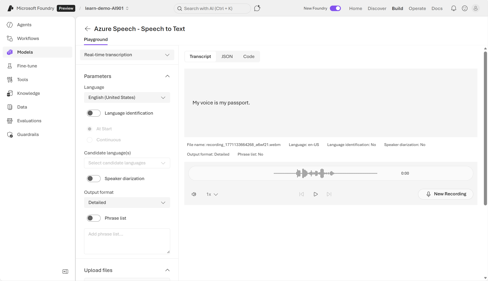
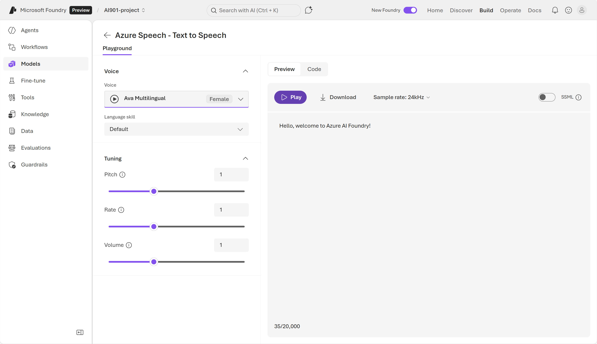
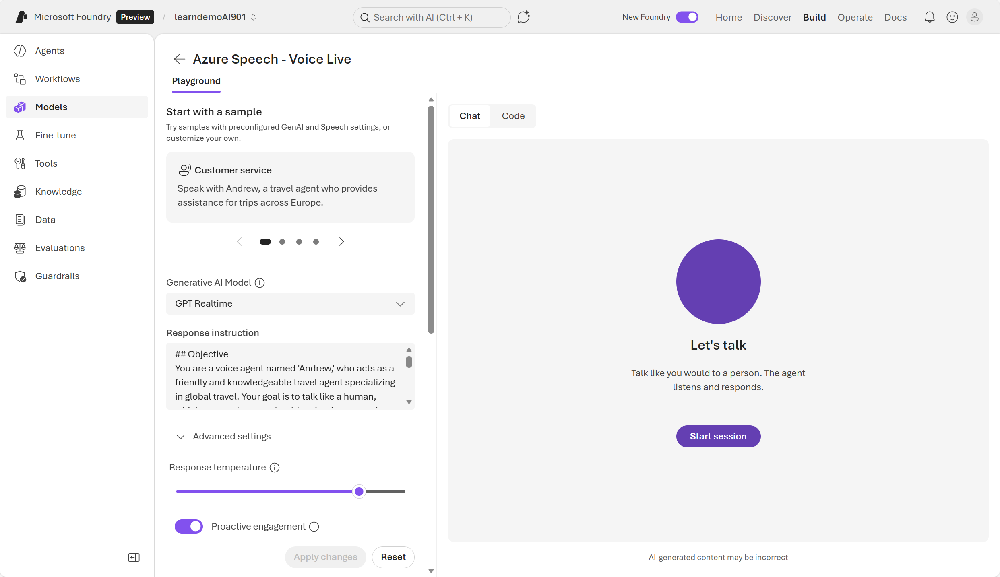
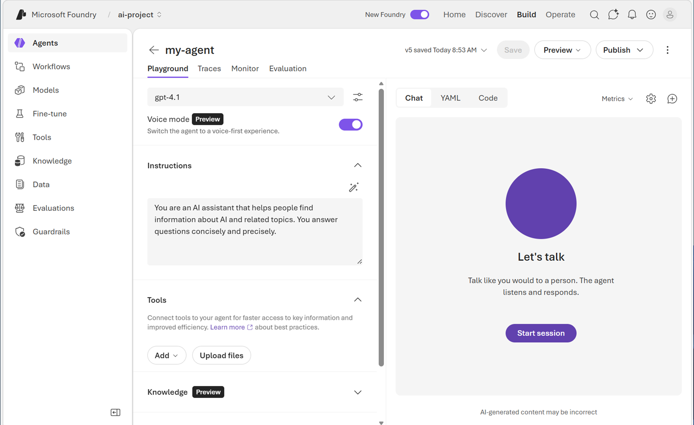
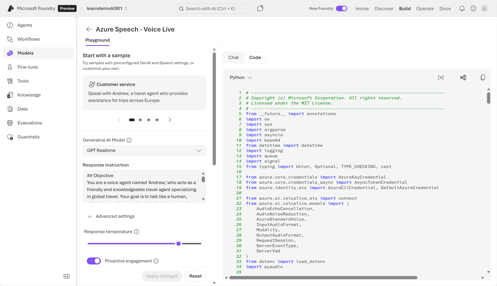
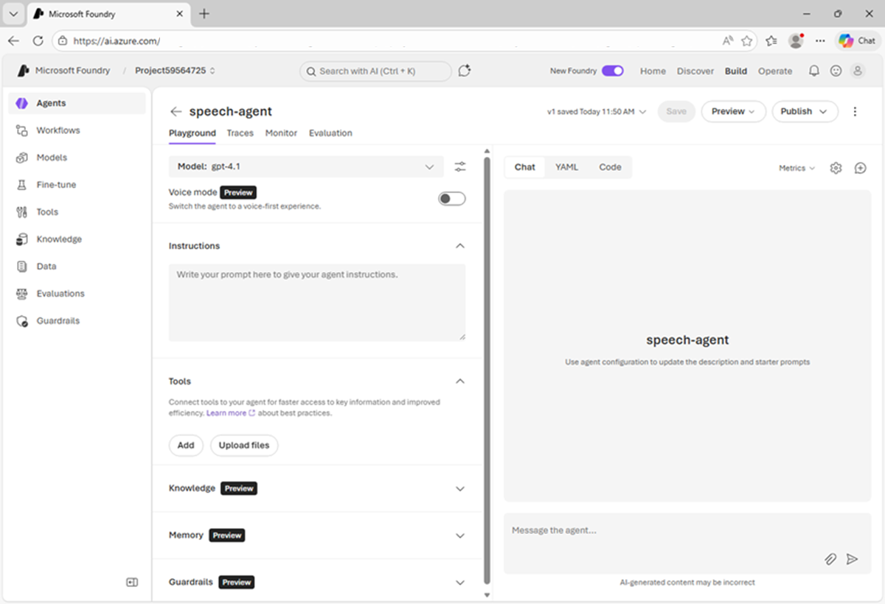
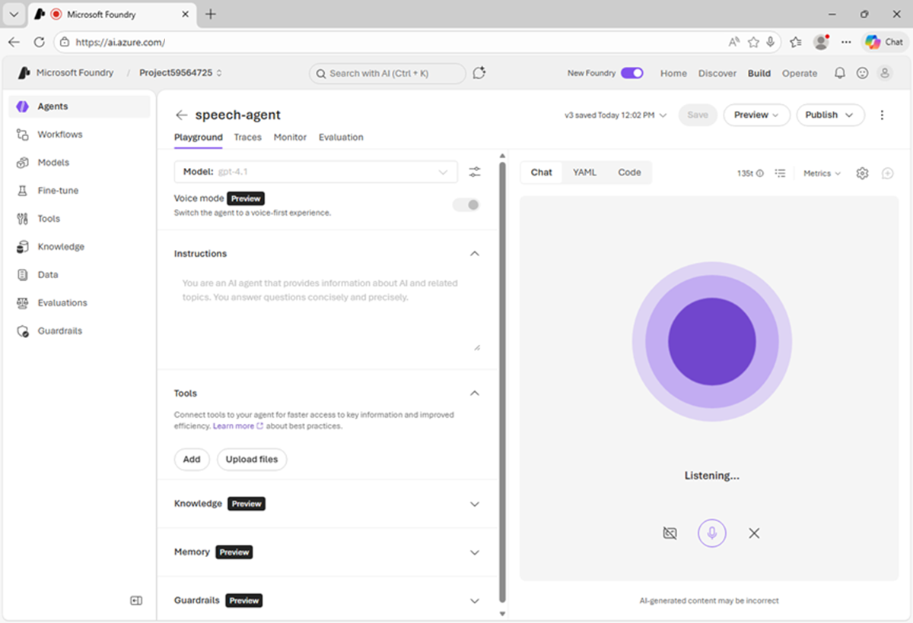

## **Get Started with Speech Analysis**

AI speech capabilities enable us to manage systems with voice instructions, get answers from computers for spoken questions, generate captions from audio, and much more. Voice-based interfaces provide a more natural way to engage with AI software

#### **Core Concepts**

1. Speech recognition — converting spoken input into text; a fundamental input capability for voice interfaces.

2. Speech synthesis — generating spoken output from text to create voice responses.

#### **Examples and use cases**

1. Clinical dictation and note taking — doctors speak notes that are transcribed to reduce typing.

2. Call transcription for customer support — real‑time transcripts help review conversations and analyze sentiment.

3. Automated captioning — generate captions for video to improve accessibility and multilingual reach.

4. Language learning and pronunciation feedback — apps listen and give corrective feedback.

5. Voice assistants in retail — spoken requests and spoken responses for shopping scenarios.

Azure Speech in Microsoft Foundry Tools provides speech‑to‑text, text‑to‑speech, and speech translation; you can use prebuilt or custom Speech service models.

### **Speech recognition**

Speech recognition (speech‑to‑text, STT): converts spoken input into text so apps and agents can respond to voice commands or audio streams

##### **How it works**

1. Acoustic model: maps audio signals into phonemes (basic sound units).

2. Language model: maps phonemes into words.

3. Output: recognized words converted into text for captions, transcripts, dictation, etc.

##### **Azure Tools**

1. Speech to Text API :- This allows you to process voice input from microphone or audio file. 
    
    In Microsoft Foundry portal, we can explore Azure Speech's speech-to-text capabilities by navigating to the Build page, then to Models, then to the AI services tab. 
    
    In the tab, you can find a selection of AI services available for testing, including Azure Speech - Speech to Text.

    

2. Azure speech-to-text SDK :- is a client library that lets applications convert spoken audio into written text. The speech-to-text SDK is designed to make speech recognition easy to add to applications.

    To use Azure Speech, you also need to create a Foundry resource. The Foundry resource endpoint and key is used in your code to authenticate your connection.

    **Development workflow (exam‑ready steps)**

        1. Install Azure Speech SDK (e.g., pip install azure-cognitiveservices-speech).

        2. Configure endpoint + key.

        3. Capture audio (microphone/file).

        4. Send audio securely to Azure Speech.

        5. Receive transcribed text + metadata

    create a python file and run it with below code

    <code>

        import azure.cognitiveservices.speech as speechsdk

        # Set up the speech config using resource endpoint
        endpoint_url = "ENDPOINT"
        speech_key = "FOUNDRY_KEY"

        speech_config = speechsdk.SpeechConfig(
            subscription=speech_key,
            endpoint=endpoint_url
        )

        # Create a recognizer with microphone input
        audio_config = speechsdk.audio.AudioConfig(use_default_microphone=True)
        
        # To read from audio file
        # audio_config = speechsdk.audio.AudioConfig(filename="voice-message.wav")

        speech_recognizer = speechsdk.SpeechRecognizer(
            speech_config=speech_config, 
            audio_config=audio_config
        )

        # Event handlers
        def recognized_handler(evt):
            print(f"Recognized: {evt.result.text}")

        def recognizing_handler(evt):
            print(f"Recognizing: {evt.result.text}")

        # Connect event handlers
        speech_recognizer.recognized.connect(recognized_handler)
        speech_recognizer.recognizing.connect(recognizing_handler)

        # Start continuous recognition
        speech_recognizer.start_continuous_recognition()
        print("Say something...")

        # Keep the program running
        input("Press Enter to stop...")
        speech_recognizer.stop_continuous_recognition()
    </code>

##### **Audio Processing options**

1. Real-time transcription:- In this you can stream the audio countinously to the service for which the application needs to be listening for incoming audio from a microphone, or other audio input source such as an audio file and then service returns transcribed text.

2. Batch Transcription:- You can process audio recordings stored on a file share, a remote server, or even on Azure storage by pointing to audio files with a shared access signature (SAS) URI and asynchronously receive transcription results.

### **Speech synthesis**

Speech synthesis, often called text-to-speech (TTS), is concerned with vocalizing data, usually by converting text to speech. Speech synthesis usually generates audible speech from a text-based source.

**How it works**

To synthesize speech, the system typically tokenizes the text to break it down into individual words, and assigns phonetic sounds to each word. It then breaks the phonetic transcription into prosodic units (such as phrases, clauses, or sentences). The system creates phonemes from the prosodic units. These phonemes are then synthesized as audio and can be assigned a particular voice, speaking rate, pitch, and volume.

#### **Azure Speech - Text to Speech**

The text-to-speech API service includes multiple predefined voices with support for multiple languages and regional pronunciation, including neural voice. Neural voices can overcome common limitations in speech synthesis such as issues with intonation, resulting in a more natural sounding voice. 

Customization: Speech Studio allows creating custom voices for brand identity or domain‑specific needs.

#### **Azure text-to-speech SDK**

The Azure Text-to-Speech SDK enables applications to convert written text into natural‑sounding spoken audio.

**Development workflow**

1. Install Azure Speech SDK.

2. Configure endpoint + key (or Entra ID).

3. Send text input.

4. Receive audio output (MP3/WAV).

5. Play or embed audio in app.

Below is sample example

<code>

    import os
    import azure.cognitiveservices.speech as speechsdk

    # This example requires environment variables named "FOUNDRY_KEY" and "ENDPOINT"
    speech_config = speechsdk.SpeechConfig(subscription=os.environ.get('FOUNDRY_KEY'), endpoint=os.environ.get('ENDPOINT'))
    audio_config = speechsdk.audio.AudioOutputConfig(use_default_speaker=True)

    # The neural multilingual voice can speak different languages based on the input text.
    speech_config.speech_synthesis_voice_name='en-US-Ava:DragonHDLatestNeural'

    speech_synthesizer = speechsdk.SpeechSynthesizer(speech_config=speech_config, audio_config=audio_config)

    # Get text from the console and synthesize to the default speaker.
    print("Enter some text that you want to speak >")
    text = input()

    speech_synthesis_result = speech_synthesizer.speak_text_async(text).get()

    if speech_synthesis_result.reason == speechsdk.ResultReason.SynthesizingAudioCompleted:
        print("Speech synthesized for text [{}]".format(text))
    elif speech_synthesis_result.reason == speechsdk.ResultReason.Canceled:
        cancellation_details = speech_synthesis_result.cancellation_details
        print("Speech synthesis canceled: {}".format(cancellation_details.reason))
        if cancellation_details.reason == speechsdk.CancellationReason.Error:
            if cancellation_details.error_details:
                print("Error details: {}".format(cancellation_details.error_details))
                print("Did you set the speech resource key and endpoint values?")
</code>

**Real‑world use cases**

1. Accessibility: screen readers that speak text aloud.

2. Customer service bots: voice responses for IVR systems.

3. Education apps: pronunciation guides and spoken lessons.

4. Navigation systems: spoken directions in cars or mobile apps.

5. Entertainment: audiobooks, character voices in games.

#### **Speech To Speech Agent**

Speech‑to‑speech agents: applications that take spoken audio as input and return spoken audio as output, enabling natural voice conversations without typing or reading

**Pipeline stages**

1. Speech‑to‑Text: convert user’s audio into text.

2. Processing/Reasoning: analyze, translate, summarize, or decide next response.

3. Text‑to‑Speech: convert response text back into spoken audio.

#### **Azure Voice Live API Service**

1. Provides real‑time voice conversations by combining STT, reasoning, and TTS in one service.

2. Fully managed by Azure — no backend setup required.

3. Can return spoken responses, visuals (avatars), and trigger actions.

4. Integrated into Foundry playground for testing and configuration (e.g., proactive engagement, voice mode)

    

5. You can also enable Voice mode for a Microsoft Foundry agent in the playground, which integrates Azure Speech Voice Live into the agent definition. This approach means that speech configuration is encapsulated in the agent itself, reducing the client code required to use it.

    

#### **Using Voice Live in an application**

1. Install azure-ai-voicelive plus dependencies (pyaudio, python-dotenv, azure-identity).

2. Use sample code from Foundry portal to:

    It handles all the logic to Initiate session, connect mic/speakers, stream incoming/outgoing audio, handle interruptions.

    

3. Running the app streams mic audio to Azure Voice Live and plays spoken responses back

#### **Sample Excersise**

1. Open  Microsoft Foundry and enable the New Foundry option in the tool bar the top of the page.Then, if prompted, create a new project with a unique name; expanding the Advanced options area to specify the following settings for your project:

    - Foundry resource: Enter a valid name for your AI Foundry resource.

    - Subscription: Your Azure subscription

    - Resource group: Create or select a resource group

    - Region: Select any of the AI Foundry recommended regions in this list

2. Select Create. Wait for your project to be created. In the Build an agent tile, select Start building and create a new agent named speech-agent. It opens the playground

    

3. In the model drop-down list, ensure that a gpt-4.1 model has been deployed and selected for your agent. Assign your agent the following Instructions:

    <code>

        You are an AI agent that provides information about AI and related topics. You answer questions concisely and precisely.
    </code>

4. Press Save button and test the agent with following prompt:

    <code>

        What can you help me with?
    </code>

5. In the pane on the left, under the model selection list, enable Voice mode. If the Configuration pane does not open automatically, use the “cog” icon above the chat interface to open it.

6. In the Configuration pane, under Voice mode, review the default speech input and output configuration. You can try different voices, previewing them until you decide which one to use. Close the Configuration pane and use the Save button to save the agent.

7. In the Chat pane, use the Start session button to start a conversation with the agent. If prompted, allow access to the system microphone.

    

8. When the app status is Listening…, say something like "How does speech recognition work?" and wait for a response. Verify that the app status changes to Processing…. The app will process the spoken input.

9. When the status changes to Speaking…, the app uses text-to-speech to vocalize the response from the model. To see the original prompt and the response as text, select the cc button on the bottom of the chat screen.

10. To continue the conversation, just ask another question, such as "How does speech synthesis work?", and review the response.

11. when finished close the agent by  ending the session. To see client code select Code at the top of the chat screen.

