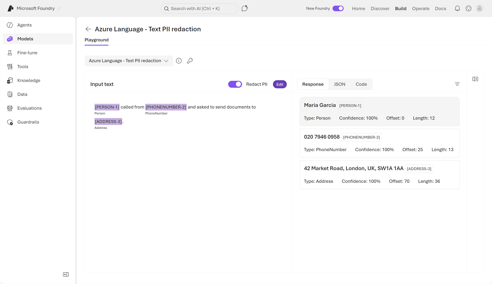
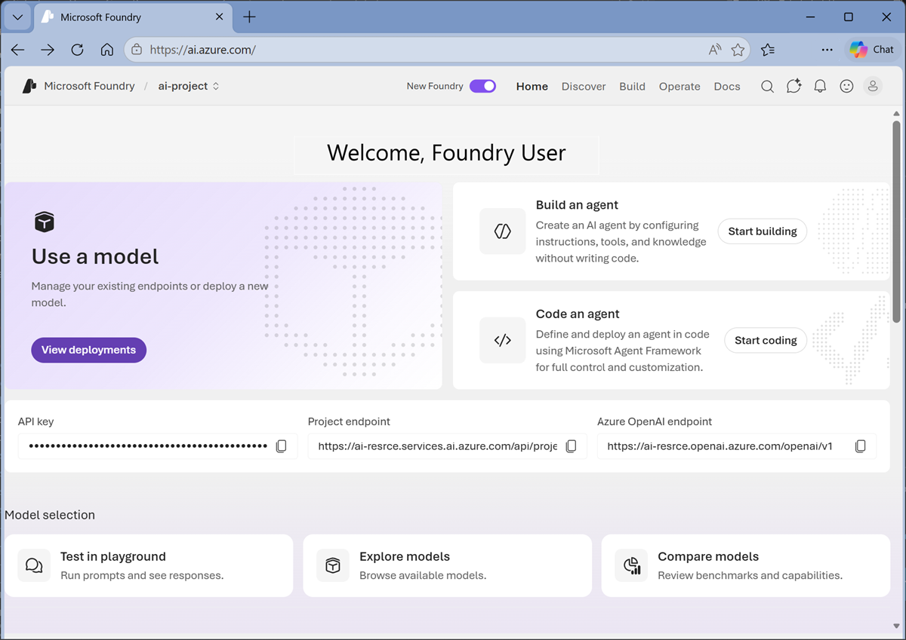
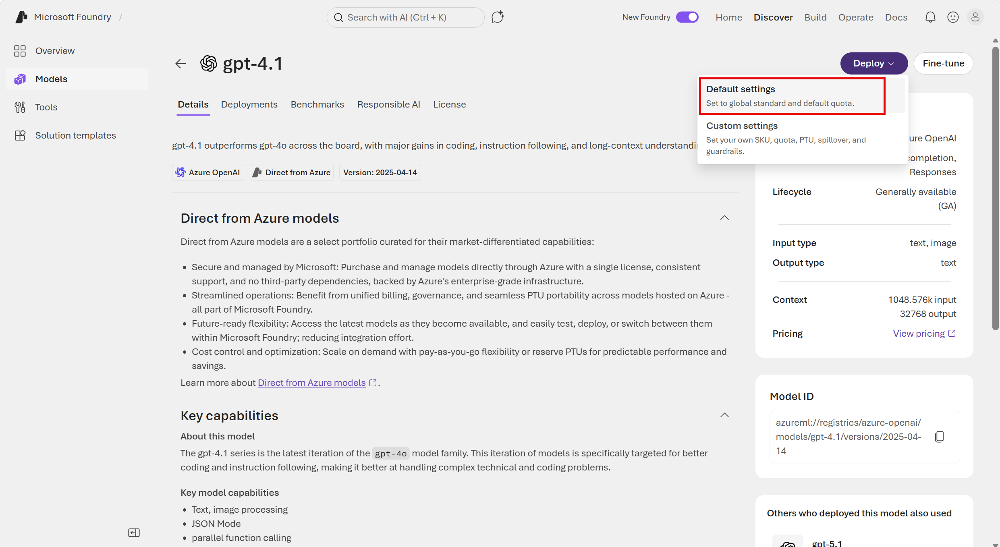
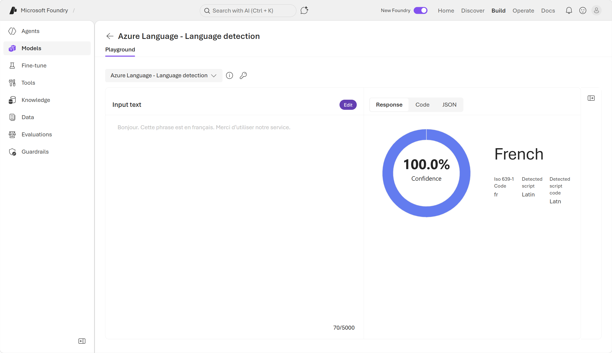
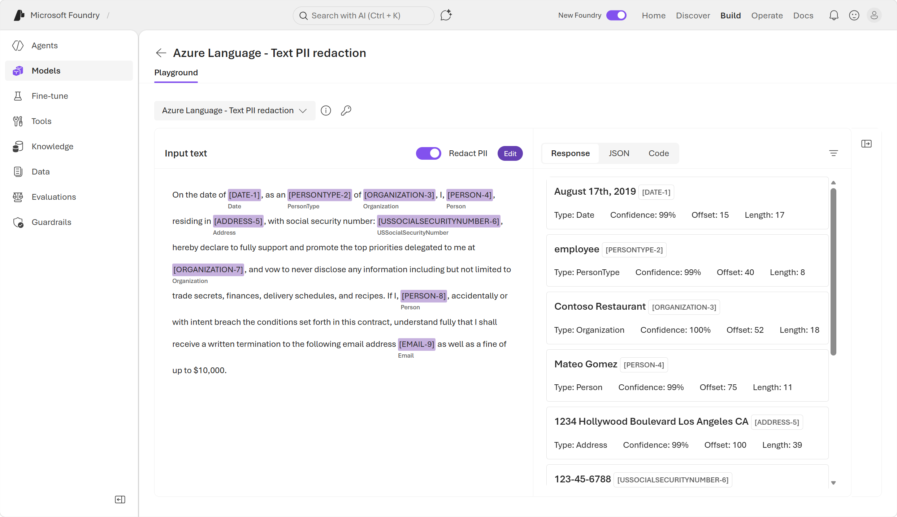

### **Get Started Text Analysis Azure**

#### **Core Concepts**

Natural Language Processing (NLP): machines’ ability to understand, interpret, and respond to human language. 

Goal of NLP: analyze and extract meaning or structure from text. 

Text analysis: automatic examination of written text to extract sentiment, keywords, entities, topics, and other structured insights.

Foundry resource vs project: a resource gives access to AI services; a project is the workspace where you deploy models and use tools like the chat playground. 
 
##### **Key Applications** 

1. Customer feedback analysis: detect trends and dissatisfaction from reviews, tickets, surveys. 

2. Healthcare text analysis: extract clinical details (symptoms, meds, diagnoses) from unstructured medical notes. 

3. Financial document processing: auto‑extract contract/loan details and compliance risks to reduce manual review. 

4. Legal summarization and classification: summarize rulings, highlight clauses, classify documents by topic.

#### **Tools to Analyse text**

1. General‑purpose language models: best when you need flexible, conversational, multi‑task analysis driven by natural language prompts (exploratory work, combined tasks, ad‑hoc analysis). 

    ##### **Some of the Capabalities**

    1. Key phrase extraction: pulls main concepts/keywords from text (useful for indexing/search). 

    2. Named entity recognition (NER): finds people, places, orgs, dates, numbers, durations, etc. Example entities shown in the page. 

    3. Sentiment analysis / opinion mining: sentence‑level or document‑level positive/negative/neutral scoring with explanations. 

    4. Summarization, translation, Q&A, classification: general‑purpose models can perform these via prompts. 

2. Azure Language analyzers (purpose‑built): use when you need deterministic, structured, repeatable outputs for pipelines (language detection, PII, specialized analyzers). In Azure AI foundary navigate to the Build page, then to Models, then to the AI services tab. Here you can look at some of the Azure language capabalities service tools

    

    ##### **Some of the Capabalities**

    1. Language detection: identifies language and confidence score for routing multi‑language workflows. 

    2. PII detection / redaction: finds and can redact personally identifiable information (names, phones, addresses, PHI). 

        

#### **Using Foundary and OpenAI API For Text Analysis**

1. Start with a Foundry resource and project; deploy a general‑purpose model.

2. OpenAI API: send requests to a deployed model endpoint with an API key.

3. Responses API: modern unified API for flexible, conversational interactions.

4. The OpenAI Python library is an official Python software development kit (SDK) that lets developers build Python applications that interact with OpenAI models and services through code instead of raw HTTP requests.

5. Install OpenAI python package
    <code>
        pip install openai
    </code>

6. create a .env file with configurations of endpoints, model name and API keys as shown below. Note:- Model deployment name is the name of the model which you provide when deploying the model in Azure foundary example: gpt-4.1-demo-model if not provided it will take default model name ex:- gpt-4.1-mini
    <code>

        AZURE_OPENAI_ENDPOINT=https://"your-resource".openai.azure.com/openai/v1/
        MODEL_DEPLOYMENT_NAME=gpt-4.1-mini 
        API_KEY="your-foundry-key"

    </code>

7. Create a python file containing the application logic 
    <code>

        import os
        from dotenv import load_dotenv
        from openai import OpenAI

        # Load environment variables from .env file
        load_dotenv()
        endpoint = os.getenv("AZURE_OPENAI_ENDPOINT")
        api_key = os.getenv("API_KEY")
        deployment_name = os.getenv("MODEL_DEPLOYMENT_NAME")

        # Create the client object
        client = OpenAI(
            base_url=endpoint,
            api_key=api_key
        )

        # Make a request using the client
        message = client.responses.create(
            model=deployment_name,
            input="",
        )

        # Print the results
        print(f"Sentiment: {message.output[0]}")
        
    </code>
8. run the commenad <code>python "filename".py</code> in the terminal and see the response

#### **Using Azure Language SDK For Azure NLP Language Model**

1. The Azure Language SDK is a client library for Azure Language in Foundry Tools. The SDK makes it easy for developers to add NLP features, such as language detection and redacting personally identifiable information (PII), to their applications.

2. Install the python sdk <code> pip install azure-ai-textanalytics</code>

3. create a config file .env with below details 
    <code>

        AZURE_LANGUAGE_ENDPOINT=https://<your-resource>.cognitiveservices.azure.com/
        API_KEY=\<your-foundry-key>
    </code>

4. create a file with below code snippet 

    <code>

        # Import packages
        import os
        from dotenv import load_dotenv
        from azure.core.credentials import AzureKeyCredential
        from azure.ai.textanalytics import TextAnalyticsClient

        # Load environment variables from .env file
        load_dotenv()
        endpoint = os.getenv("AZURE_LANGUAGE_ENDPOINT")
        key = os.getenv("API_KEY")

        # Create the client
        client = TextAnalyticsClient(endpoint=endpoint, credential=AzureKeyCredential(key))

        # Make a request using the client for language detection
        text = "¡Hola! Me llamo Josefina y vivo en Madrid, España."
        result = client.detect_language([text])[0]

        # Print the results
        print(f"Language      : {result.primary_language.name}")
        print(f"ISO code      : {result.primary_language.iso6391_name}")
        print(f"Confidence    : {result.primary_language.confidence_score:.2f}")

        #PII (personally identifiable information)

        text = "Maria Garcia called from 020 7946 0958 and asked to send documents to 42 Market Road, London, UK, SW1A 1AA."

        result = client.recognize_pii_entities([text])[0]

        # Print the results
        print("Redacted text:", result.redacted_text)
        print("\nEntities found:")
        for entity in result.entities:
            print(f"  {entity.text} | category={entity.category} | confidence={entity.confidence_score}")

    </code>

5. Run the code and see the response with Azure Language SDk we can get more structured and more insights from the text 

#### **Understand MCP**
 MCP like a universal adapter: instead of writing custom integration code for every service an agent needs, you connect the agent to an MCP server that already exposes those capabilities in a standard way.

MCP uses a client-server architecture:

1. The MCP client is the AI agent (or the host application running the agent). It sends requests and receives responses.
2. The MCP server is the service that exposes tools, data, or actions. It listens for requests, executes the appropriate capability, and returns a structured result.

When an agent connects to an MCP server, it can discover what tools the server offers and invoke them as needed

**Azure Language MCP Server**

The Azure Language MCP server is a managed service that exposes Azure Language in Foundry Tools capabilities through MCP. It acts as the bridge between your agent and the full suite of Azure Language features—named entity recognition, sentiment analysis, language detection, and more.

**Use the Azure Language MCP server in Foundry portal**

1. To build an agent that uses Azure Language, you can start in the Foundry portal by deploying a model and saving it as an agent.

2. You can add the Azure Language MCP server as a tool in the Foundry playground by searching tools for Azure Language in Foundry Tools. To connect to the Azure Language MCP server, configure your connection with your Foundry resource name. Once you've connected the MCP server to your agent, use prompts to instruct the agent to analyze text using the tool.

    

#### **Excersize**

1. Log in to Azure foundry website and create a new project with unique name click on advance options and set below details:-

    1. Foundry resource: Enter a valid name for your AI Foundry resource.
    2. Subscription: Your Azure subscription
    3. Resource group: Create or select a resource group
    4. Region: Select any of the AI Foundry recommended regions in this list

2. Select Create. Wait for your project to be created. It may take a few minutes. After creating or selecting a project in the new Foundry portal, it should open in a page similar to the following image:

    

3. From the Foundry home page in the new Foundry portal interface, select Start building. Then select Find models to view the Microsoft Foundry model catalog.

    

4. Search for and select the gpt-4.1 model, and view the page for this model, which describes its features and capabilities.

5. Use the Deploy button to deploy the model using the default settings. Wait for the deployment to complete. After the deployment is complete, you are taken to a chat playground, where you can test out the model’s capabilities.

    

6. Sentiment analysis is a common natural language processing (NLP) task. It’s used to determine whether text conveys a positive, neutral or negative sentiment. In chat play ground enter below prompt 

    <code>

        Analyze the following review, and determine whether the sentiment is positive, neutral, or negative:
        ---
        I spent several nights at the Riverside Heights Hotel during a fall trip, and the experience was outstanding from start to finish. The welcome at arrival was warm and attentive, and the staff consistently went out of their way to be helpful. The overall atmosphere made my stay smooth and relaxing, and the location was extremely convenient for getting around the city. I left with a very positive impression and would confidently recommend this hotel to others looking for a pleasant and stress‑free stay.
        ---
    </code>

7. Review the response. And enter following prompt to analyse different review

    <code>
        
        What about this one?
        ---
        I was disappointed with my visit to the Harbor View Inn earlier this year. The front desk process took much longer than expected, and staff responses to questions felt rushed and unhelpful. The room had ongoing maintenance issues, inconsistent internet access, and noticeable noise from the hallway throughout the night. Overall, the experience fell short of expectations, and I would not choose to stay there again.        
        ---
    </code>

8. Named entities are the people, places, dates, and other important items mentioned in text. At the top of the panel use "New chat" to restart conversation and enter below prompt.

    <code>

        List the named entities mentioned in this text:
        ---
        Welcome to the Global Innovation Workshop!
        We’re excited to host sessions in London, Toronto, Chicago, and Austin this spring.
        Visit our event page for specific dates, venues, and city details.
        ---
    </code>

9. The model; should identify specified places in the list

10. Summarization is a way to distill the main points in a document into a shorter amount of text.At the top of the panel use "New chat" to restart conversation and enter below prompt.

    <code>
        
        Summarize the following meeting transcript in a single paragraph
        ---
        Jordan Lee: “We should pick a retreat location that’s convenient for most people—Chicago and Nashville came to mind first.”
        Anika Sharma: “Chicago is central, but the venue costs there can add up quickly.”
        Carlos Ramirez: “I looked into a few alternatives, and Phoenix seems much easier when it comes to flights and space.”
        Jordan Lee: “That makes sense—Phoenix does offer more flexibility than Chicago or Portland.”
        Anika Sharma: “Portland would be enjoyable, but from a planning standpoint, Phoenix is simpler.”
        Carlos Ramirez: “Exactly. It scales better and avoids some of the pricing issues.”
        Jordan Lee: “So it sounds like Phoenix is our strongest option overall.”
        Anika Sharma: “Yes, I’m comfortable choosing Phoenix over the other cities.”
        Carlos Ramirez: “Agreed—let’s move forward with Phoenix for the retreat.”
    </code>

11. the model should generate the summary text

#### **Part 2 Use a specialized language analysis tool**

12. The Azure Language in Foundry Tools provides purpose-built analyzers that use statistical techniques to return structured, deterministic results — ideal for consistent output in automated pipelines. In the new Foundry portal, navigate to the menu at the top of the screen and select Build.

13. In the Build page navigate to side menu and select Models and then at the top slect "AI Services"

    

14. From the list of AI services, select the Azure Language - Language detection analyzer. In input list select one of the sample documents. Then use detect button 

    

15. After reviewing the detected language details, click on the Edit button icon to make the input text editable again. Now you can:
    1. Select another sample.
    2. Type your own text.
    3. Upload a text file.
    
    Below is a sample text

    <code>

        ¡Hola! Me llamo Josefina y vivo en Madrid, España. Soy doctora en un hospital, ¡lo que me mantiene muy ocupada!
    </code>

16. Return to the list of AI services by click on the back button at the top of the playground screen.

17. To comply with privacy policies and laws, organizations often need to detect and redact personally identifiable information (PII) such as names, addresses, phone numbers, email addresses, and other personal details. In the list of AI services, select the Azure Language - Text PII extraction analyzer.

18. In input list select one of the sample documents. Then use detect button to detect Personally Identifiable Information 

    

19. After reviewing the detected PII details, click on the Edit button to make the input text editable again. Experiment with input of your own. 

20. Select the Code tab on the right to view sample code for PII identification.

    <code>
        
        key = "paste-your-key-here"
        endpoint = "paste-your-endpoint-here"

        from azure.ai.textanalytics import TextAnalyticsClient
        from azure.core.credentials import AzureKeyCredential

        # Authenticate the client using your key and endpoint 
        def authenticate_client():
            ta_credential = AzureKeyCredential(key)
            text_analytics_client = TextAnalyticsClient(
                    endpoint=endpoint, 
                    credential=ta_credential)
            return text_analytics_client

        client = authenticate_client()

        # Example method for detecting sensitive information (PII) from text 
        def pii_recognition_example(client):
            documents = [
                "$documents"
            ]
            response = client.recognize_pii_entities(documents, language="en")
            result = [doc for doc in response if not doc.is_error]
            for doc in result:
                print("Redacted Text: {}".format(doc.redacted_text))
                for entity in doc.entities:
                    print("Entity: {}".format(entity.text))
                    print(" Category: {}".format(entity.category))
                    print(" Confidence Score: {}".format(entity.confidence_score))
                    print(" Offset: {}".format(entity.offset))
                    print(" Length: {}".format(entity.length))
        pii_recognition_example(client)
    </code>