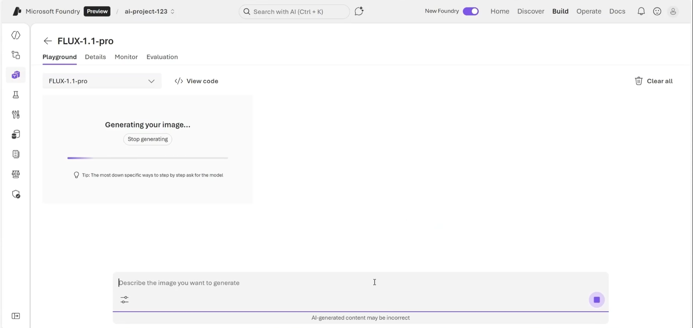
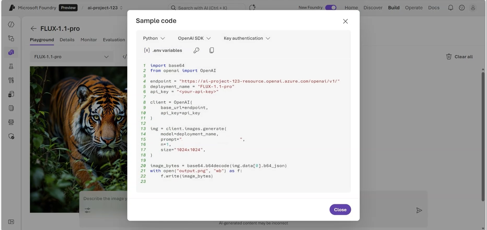
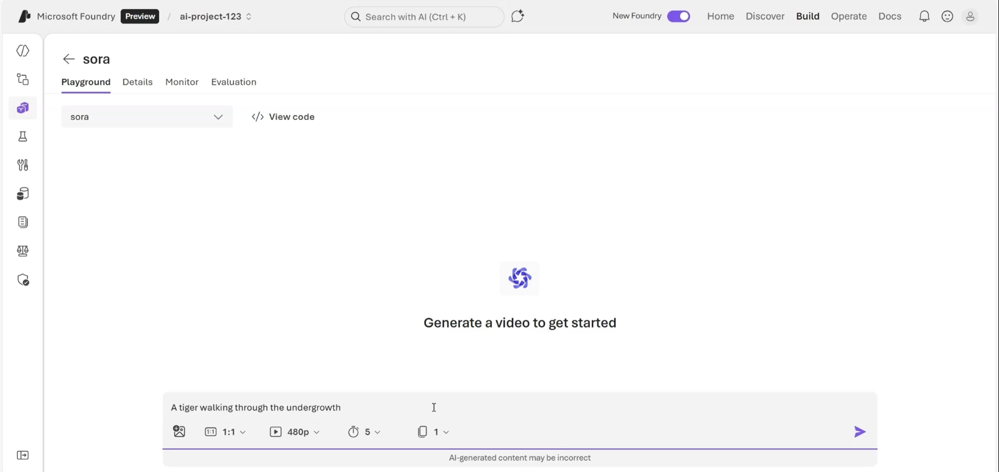
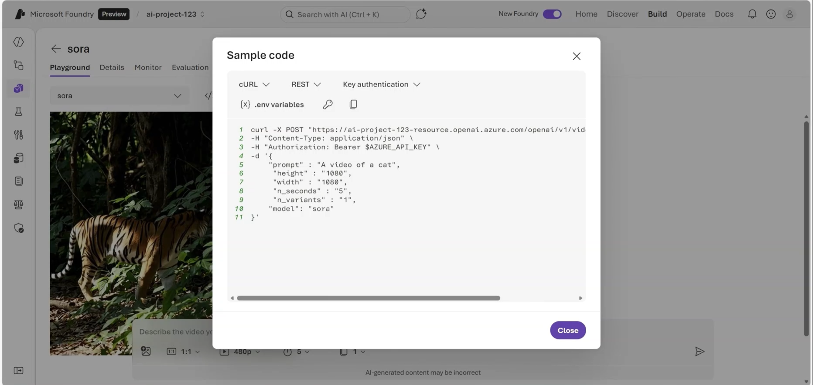
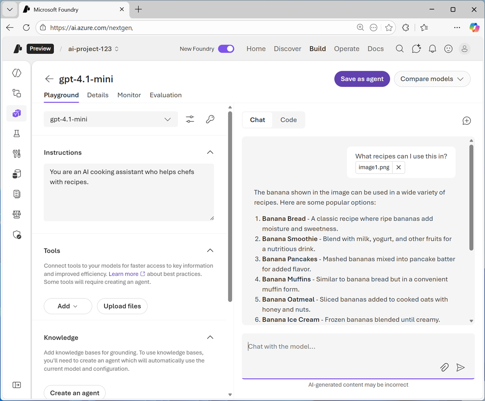
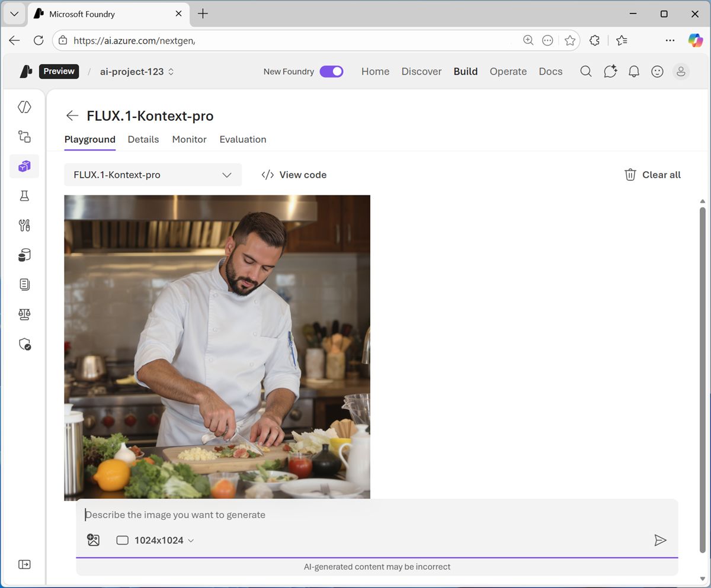
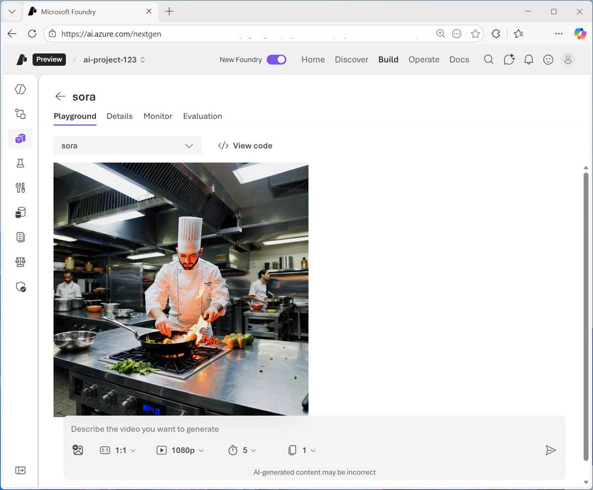

### **Get Started with Vision Azure**

Computer vision: AI capability that enables machines to interpret and analyze visual input (images, video).

Vision AI automates tasks that require visual understanding. Helps reduce manual effort, improve accuracy, and enable new experiences (e.g., accessibility, safety monitoring).

#### **Common Applications of Computer Vision**

1. Defect detection in manufacturing: AI vision systems inspect products on assembly lines in real time. They detect defects using object detection and image segmentation

2. Medical imaging analysis: Computer vision helps radiologists analyze X-rays, MRIs, and CT scans. AI models can highlight anomalies like tumors or fractures, assist in early diagnosis, and reduce human error.

3. Shelf monitoring in retail: Retailers use AI vision to monitor store shelves to enable real-time inventory updates and improving customer experience.

4. Autonomous vehicles: Self-driving cars rely on computer vision to recognize road signs, lane markings, pedestrians, and other vehicles.

#### **Core Definition**

Multimodal models: AI models that process more than one type of input (text, images, audio, video) simultaneously

They can describe images in natural language, answer questions about photos, or extract meaning from charts and documents

The ability for models to combine visual understanding with natural language responses is referred to as vision‑enabled GPT models or GPT with vision.

example, vision‑enabled GPT models in Foundry can:

1. Describe the contents of an image in natural language
2. Answer questions about objects, text, or scenes in an image
3. Extract meaning from charts, screenshots, documents, or photos
4. Combine image understanding with text instructions in a single prompt

**Foundry capabilities**

1. Vision‑enabled GPT models (GPT‑4.1 family): handle text + images together; used for image description, visual Q&A, document/screenshot analysis, chart interpretation.

2. GPT‑5 series: advanced multimodal models for enterprise/agentic scenarios; support structured outputs, tool use, large‑context multimodal reasoning.

3. Partner models: Foundry also hosts multimodal models from other providers (e.g., Anthropic)

**Playground & APIs**

1. Foundry playground: lets you upload images, test prompts, and see how models interpret visual input.

2. Azure OpenAI Responses API: supports native multimodal inputs (text + images in one request).

3. Python SDK: developers can send images + text to deployed models and get natural language responses

Below is the example of Python OpenAI SDK to get description of image

<code>

    import os
    from openai import OpenAI

    # Environment variables you set locally or in your app service:
    FOUNDRY_KEY = "... your key ..."
    ENDPOINT = "https://YOUR-RESOURCE-NAME.openai.azure.com/openai/v1/"
    MODEL_NAME = "your-model-deployment-name"  # e.g., "gpt-4.1-mini" deployed as "my-vision-deploy"

    client = OpenAI(
        api_key=os.getenv("FOUNDRY_KEY"),
        base_url=os.getenv("ENDPOINT"),
    )

    image_path = "./" + input("Enter the image filename with extension: ")

    with open(image_path, "rb") as image_file:
        image = base64.b64encode(image_file.read()).decode("utf-8")

    prompt_text = input("Enter your prompt: ")

    response = client.responses.create(
        model=os.getenv("MODEL_NAME"),  # your deployment name
        input=[
            {
                "role": "user",
                "content": [
                    {"type": "input_text", "text": prompt_text},
                    {"type": "input_image", "image_url": f"data:image/jpg;base64,{image}"}
                ],
            }
        ],
    )

    print(f"\n {response.output[0].content[0].text} \n")

</code>

#### **Image Generation Model**

Image generation models: AI systems that create new images from prompts (text, other images, or structured inputs).

They are part of generative AI and extend vision capabilities beyond analysis into creation.

##### **examples of image generation models**

1. GPT‑Image‑1.5: GPT‑Image‑1.5 it's designed for high‑fidelity, enterprise‑grade image creation and editing, with strong prompt alignment and improved consistency across iterations. The model supports text‑to‑image, image‑to‑image, and precise image editing, making it well suited for branding, marketing, and design workflows where visual accuracy matters.

2. GPT‑Image‑1: is a powerful, general‑purpose image generation model. It supports text‑to‑image generation, image variations, and precise image editing. It's commonly used for creative applications, prototyping, and visual content generation.

3. GPT‑Image‑1‑Mini is a lighter‑weight and more cost‑efficient version of GPT‑Image‑1. It supports the same core image generation tasks but is optimized for scenarios where lower latency or reduced cost is more important than maximum visual fidelity.

**Image generation in the Foundry playground**

These models can be deployed as vision-enabled model and test it in the Foundry portal playground.

**Image generation using python SDK**

Below is the sample code using openAI SDK and azure foundry video generation model

<code>

    import os
    import base64
    from openai import OpenAI

    # Required environment variables (example names)
    FOUNDRY_KEY="..."
    ENDPOINT="https://YOUR-RESOURCE-NAME.openai.azure.com/openai/v1/"
    MODEL_NAME="your-gpt-image-deployment-name"  # e.g., "gpt-image-1"

    client = OpenAI(
        api_key=os.environ["FOUNDRY_KEY"],
        base_url=os.environ["ENDPOINT"],
    )

    prompt = "A modern flat illustration of a robot holding a potted plant, clean vector style, pastel colors."

    response = client.responses.create(
        model=os.environ["MODEL_NAME"],  # your deployment name in Foundry
        input=prompt,
        tools=[{"type": "image_generation"}],
    )

    image_base64 = next(
        item.result for item in response.output
        if item.type == "image_generation_call"
    )

    with open("foundry_generated.png", "wb") as f:
        f.write(base64.b64decode(image_base64))

    print("Saved: foundry_generated.png")

</code>

#### **Video generation models**

Video generation models: AI systems that create new video content from prompts (text, images, or structured inputs).

**Video generation Models in Azure foundry**

1. Sora1:- is OpenAI’s first text‑to‑video model made available in Microsoft Foundry. It generates short video clips from text prompts and can also use images as input to guide video creation.

2. Sora2:- s the next‑generation video generation model in Foundry.It supports multiple modalities, including: Text → video, Image → video, Video → video (remix). Sora 2 also introduces audio generation, improved realism, and remixing capabilities that allow targeted edits instead of regenerating an entire video.

**Video generation in the Foundry playground**

Once deployed an appropriate video generation model, you can test it in the Foundry portal playground. you can also specify parameters like video dimensions, duration and prompts to the video generation model should include a description of the content in the desired video.

**Using the REST Interface for video generation**

You can use the Foundry REST interface to request a video generation job and retrieve the finished MP4 programmatically.

Video generation is typically asynchronous: you create a job, poll for status, then download the MP4 when complete; runtimes commonly range 1–5 minutes depending on settings.

example of using the Azure OpenAI v1 API with the Sora 2 model:-

1.  Create a video job
    <code>

        curl -X POST "https://YOUR-RESOURCE-NAME.openai.azure.com/openai/v1/videos" \
        -H "Content-Type: application/json" \
        -H "api-key: $AZURE_OPENAI_API_KEY" \
        -d '{
            "model": "sora-2",
            "prompt": "A cinematic close-up of raindrops sliding down a neon-lit window at night.",
            "size": "1280x720",
            "seconds": "8"
        }'

    </code>

2.  Poll job status until completed

    <code>

        curl -X GET "https://YOUR-RESOURCE-NAME.openai.azure.com/openai/v1/videos/{video_id}" -H "api-key: $AZURE_OPENAI_API_KEY"

    </code>

3.  Download the completed video

    <code>

        curl -L "https://YOUR-RESOURCE-NAME.openai.azure.com/openai/v1/videos/{video_id}/content?variant=video"  -H "api-key: $AZURE_OPENAI_API_KEY"  --output output.mp4

    </code>

#### **Excercise**

1.  open Microsoft Foundry in the tool bar the top of the page, enable the New Foundry option. Then, if prompted, create a new project with a unique name; expanding the Advanced options area to specify the following settings for your project:
    - Foundry resource: Enter a valid name for your AI Foundry resource.
    - Subscription: Your Azure subscription
    - Resource group: Create or select a resource group
    - Region: Select any of the AI Foundry recommended regions in this list

2.  Wait for the project to be created once done it will open page similar as below

3.  In other browser tab download the images [images.zip](https://microsoftlearning.github.io/mslearn-ai-fundamentals/data/images.zip) and extract the contents to local folder

4.  in Microsoft Foundry project Discover page, select the Models tab to view the Microsoft Foundry model catalog. Search and deploy the gpt-4.1-mini model using the default settings.

5.  After deployment you can see model playground page that is opened, in which you can chat with the model.

6.  In the pane on the left, set the Instructions to "You are an AI cooking assistant who helps chefs with recipes."

7.  In the chat pane, use the Upload image button to select one of the images you extracted on your computer. Enter prompt text like "What recipes can I use this in?" and submit. Review the response.

8.  Try diffrent promts by submitting different images from the downloaded image samples and review the responses

9.  To develop a client application select Code tab in the chat pane and select following code options:-
    - API: Responses API
    - Language: Python
    - SDK: OpenAI SDK
    - Authentication: Key authentication

10. create a python file with below code and run it.

    <code>

        from openai import OpenAI

        endpoint = "https://your-project-resource.openai.azure.com/openai/v1/"
        deployment_name = "gpt-4.1-mini"
        api_key = "<your-api-key>"

        client = OpenAI(
            base_url=endpoint,
            api_key=api_key
        )

        response = client.responses.create(
            model=deployment_name,
            input=[{
                "role": "user",
                "content": [
                    {"type": "input_text", "text": "what's in this image?"},
                    {"type": "input_image", "image_url": "https://an-online-image.jpg"},
                ],
            }],
        )

        print(f"answer: {response.output[0]}")

    </code>

11. Use the “back” arrow next to the gpt-4.1-mini header to view the model deployment. Select Deploy a base model to open the model catalog

12. In the Collections drop-down list, select Direct from Azure, and in the Inference tasks drop-down list, select Text to image. Then view the available models for image generation.

    

13. Select an available text-to-image model, such as FLUX.2-pro or FLUX-1-Kontext-pro, and deploy it.When the model has been deployed, it opens in the image playground.

14. Enter a prompt describing a desired image; for example "A chef preparing a meal". Then review the generated image.

    

15. If your deployed model includes code samples, in the Chat pane, select the Code tab to view sample code. with following code options
    - Language: Python
    - SDK: OpenAI SDK
    - Authentication: Key authentication

    <code>

        import base64
        from openai import OpenAI

        endpoint = "https://your-project-resource.openai.azure.com/openai/v1/"
        deployment_name = "your-text-to-image-model-deployment"
        api_key = "<your-api-key>"

        client = OpenAI(
            base_url=endpoint,
            api_key=api_key
        )

        img = client.images.generate(
            model=deployment_name,
            prompt="A cute baby polar bear",
            n=1,
            size="1024x1024",
        )

        image_bytes = base64.b64decode(img.data[0].b64_json)
        with open("output.png", "wb") as f:
            f.write(image_bytes)

    </code>

16. Use the “back” arrow next to the image-generation model header to view the model deployments in your project. Select Deploy a base model to open the model catalog

17. In the Collections drop-down list, select Direct from Azure, and in the Inference tasks drop-down list, select Video generation. Then view the available models for video generation. Select the Sora-2 model and deploy it.

    

18. When the model has been deployed, it opens in the video playground. Enter a prompt describing a desired video; for example "A chef in a busy kitchen." Then review the generated video.
    

19. In the Chat pane, select the Code tab to view sample code.The default sample code uses the curl command to call the REST endpoint, and should look similar to this:

    <code>

         curl -X POST "https://your-project-resource.openai.azure.com/openai/v1/video/generations/jobs" \
        -H "Content-Type: application/json" \
        -H "Authorization: Bearer $AZURE_API_KEY" \
        -d '{
            "prompt" : "A video of a cat",
            "height" : "1080",
            "width" : "1080",
            "n_seconds" : "5",
            "n_variants" : "1",
            "model": "sora"
            }'
    </code>
