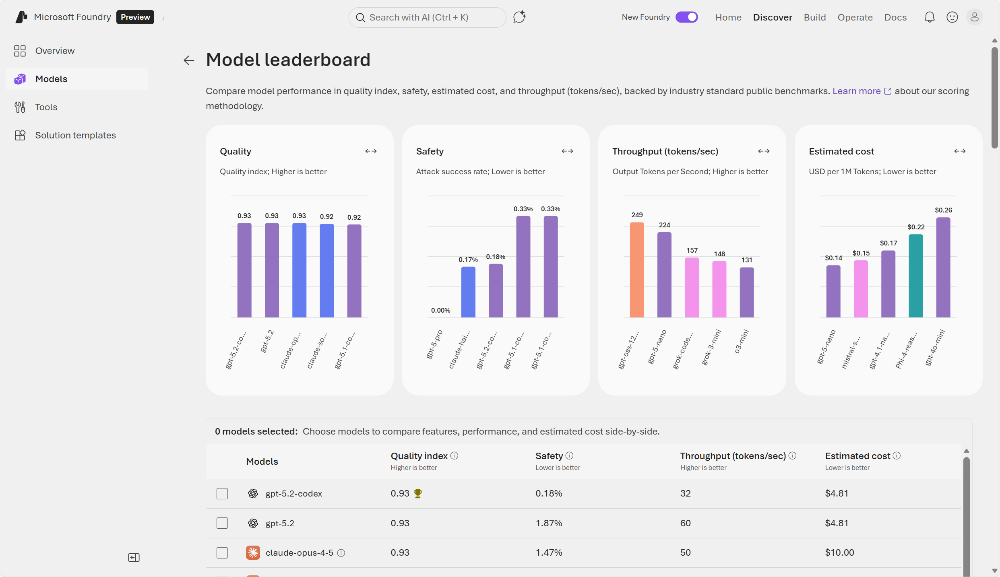
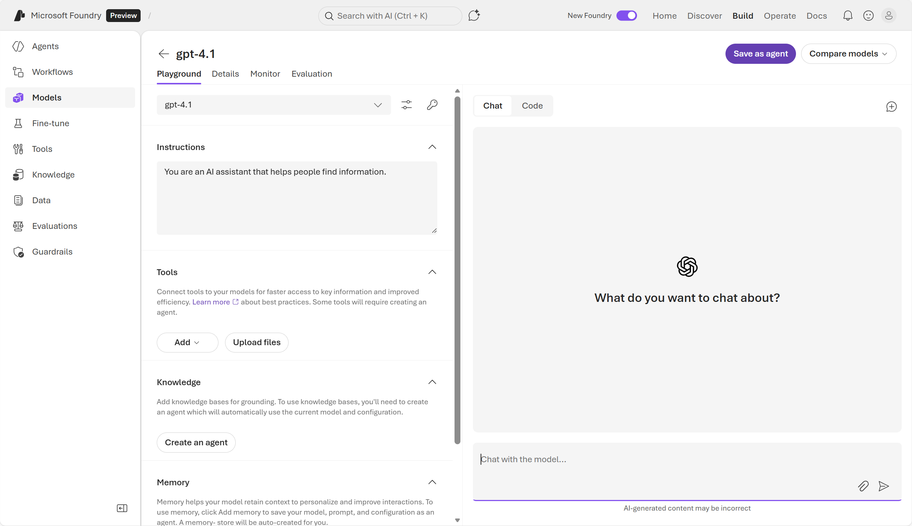
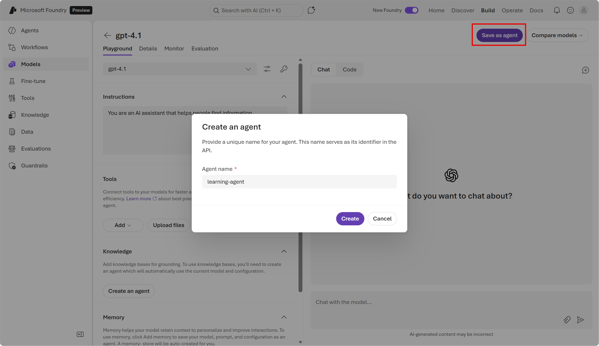
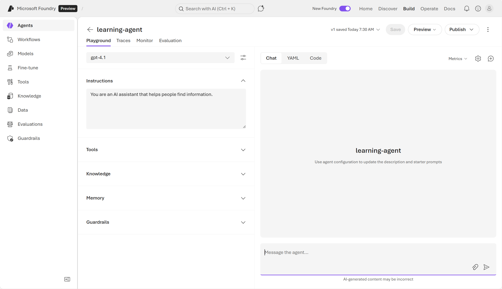
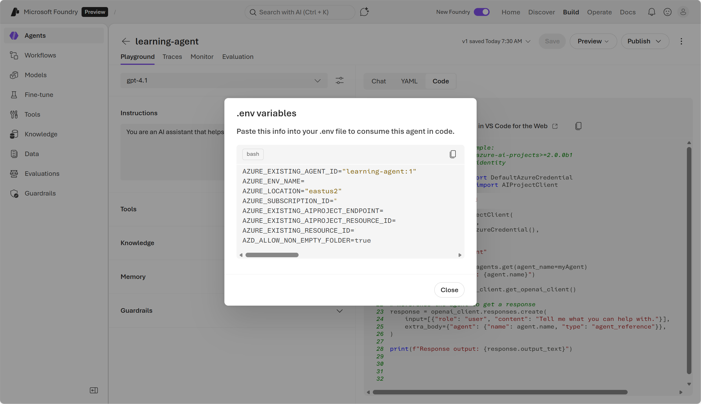
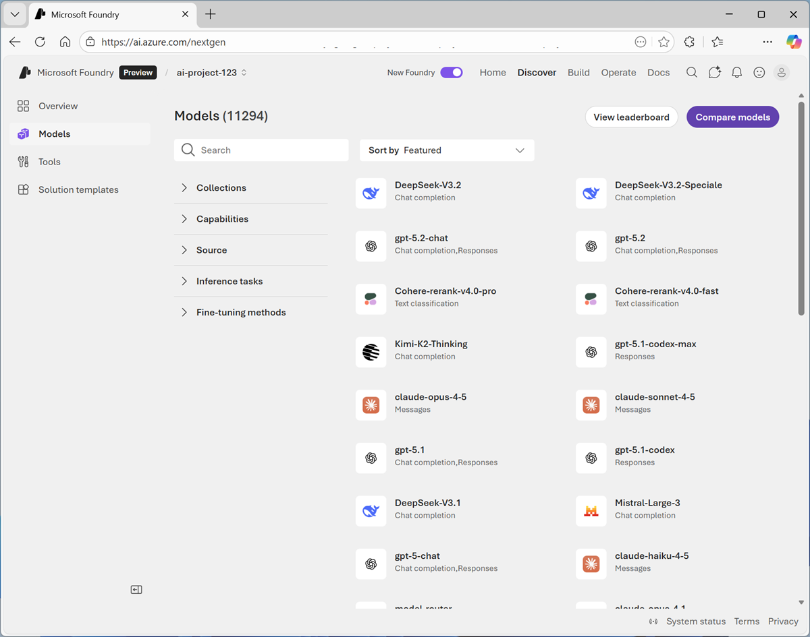

## **Get Started With AI and Agents in Azure**

### **Generative AI models**

Large language models form the foundation of generative AI and agentic solutions; choose model size and specialization to match device, domain, and accuracy needs.

#### **Model catalog and selection**

1. Foundry’s model catalog is a central hub for discovering, filtering, testing, and comparing models from Microsoft, partners, and open‑source providers.

2. Use cases drive choice: pick lightweight models for phones, domain‑tuned models for regulated workloads, and higher‑reasoning families for complex agent tasks.

3. Each model entry typically includes:

   a. Model descriptions and capabilities (text generation, reasoning, coding, multimodal, embeddings, etc.)

   b. Benchmark results and performance comparisons

   c. Supported inference tasks and fine‑tuning options

   d. Responsible AI documentation (model cards, constraints, caveats)

#### **Evaluate and Safety**

example of selecting model by type

<table aria-label="Select a model by task type" class="table">
    <thead>
        <tr>
            <th><strong>Task</strong></th>
            <th><strong>Recommended model types</strong></th>
            <th><strong>Model details</strong></th>
        </tr>
    </thead>
    <tbody>
        <tr>
            <td><strong>Chat</strong></td>
            <td>GPT‑5.x chat, Claude Sonnet/Opus, Mistral‑Large‑3, DeepSeek V3.1, small language models (SLMs) like Phi‑4 or Llama</td>
            <td>Strong reasoning, conversation tuning, safety</td>
        </tr>
        <tr>
            <td><strong>Coding</strong></td>
            <td>GPT‑5.1‑codex, Claude‑Sonnet</td>
            <td>Support for complex agent flows</td>
        </tr>
        <tr>
            <td><strong>Summarization</strong></td>
            <td>GPT‑5.x reasoning models, Claude Opus/Sonnet</td>
            <td>Long-context, high-quality compression</td>
        </tr>
        <tr>
            <td><strong>Embeddings</strong></td>
            <td>text‑embedding‑3-small or other embedding models</td>
            <td>Built for semantic vector representations</td>
        </tr>
        <tr>
            <td><strong>Multimodal</strong></td>
            <td>Phi‑4‑multimodal‑instruct, GPT‑5.x chat multimodal, Mistral‑Large‑3</td>
            <td>Support for images, audio, and video in chat completions</td>
        </tr>
        <tr>
            <td><strong>Industry or domain-specific</strong></td>
            <td>Domain-tuned models in the catalog</td>
            <td>Applications specific to an industry such as finance, healthcare, legal</td>
        </tr>
    </tbody>
</table>

1. Benchmarks and evaluators let you score models on quality, safety, and throughput; Foundry provides leaderboards, NLP metrics (accuracy, F1), and AI‑assisted metrics (groundedness, relevance).

2. Use evaluators for safety (content scanning, bias checks); evaluators detect issues but do not automatically fix them.

#### **Deployment and operational controls**

1. Deploying a model creates a managed endpoint with allocated compute, locked configuration, monitoring, and quotas so apps can call the model securely and reliably.

2. Throughput and throttling: deployments use tokens‑per‑minute (TPM) or capacity units; set TPM to match expected load and handle throttling by lowering max tokens or concurrency.

3. Monitoring: track usage, latency, errors, and cost after deployment; choose deployment type (standard, provisioned, batch) to balance cost and performance.

4. Deployment‑level quotas define how many tokens or requests can be processed before throttling occurs. Larger prompts and higher max output token settings consume more TPM, leading to rate-limit errors if exceeded

5. When you deploy a model in Foundry, several things occur:

   a. Compute resources are allocated: Foundry assigns the hardware needed to run the model—CPUs, GPUs, memory, networking, and scaling rules.

   b. An API endpoint is created: You're able to securely invoke the model through the OpenAI Responses API, validated through management API checks.

   c. Configuration (such as model version, response style, safety settings) is locked in

   d. Monitoring and logging become active: usage metrics, performance, latency, errors, and costs are tracked

### **Using a generative AI model**

The easiest way to interact with a deployed model is to use the model playground in the Foundry portal. You can use the Foundry Playgrounds to try prompts, compare models, and capture working settings before you write any code.

#### **Key Playground concepts you must know**

1. Playground role: Use it to try prompts, compare models, capture working settings, and generate the starter code you’ll reuse in apps.

2. Important runtime parameters: temperature (creativity vs determinism), max output tokens (limits response length and token usage), and system instructions (set model behavior, tone, and guardrails).

3. System vs user prompts: System prompts define the assistant’s role and constraints; user prompts are the end‑user requests. Use the Playground to tune both before coding.

#### **From Playground to code — practical steps**

1. Starter code: The Playground provides OpenAI‑compatible Responses API code you can copy and adapt for production.

2. Lightweight chat client pattern: Build a minimal client (CLI, simple web page, or small desktop utility) that sends user input to the Foundry endpoint and displays results; keep state and heavy compute on the server.

3. SDKs: Use the Foundry SDK (Project client + OpenAI‑compatible client) to simplify authentication and calls; the page shows a Python example for calling

<code>

        # pip install openai>=1.3.0
        # pip install azure-ai-projects azure-identity openai

        import os
        from openai import OpenAI

        client = OpenAI(
            base_url=f"{os.environ['AZURE_OPENAI_ENDPOINT']}/openai",
            api_key=os.environ["AZURE_OPENAI_API_KEY"]
        )

        response = client.responses.create(
            model=os.environ["DEPLOYMENT_NAME"],          # e.g., "gpt-4o-mini"
            input=[{"role": "system", "content": "You're a helpful assistant."},
                {"role": "user", "content": "Summarize the key points from our  release notes in 3 bullets."}],
            max_output_tokens=300,
            temperature=0.7
        )

        print(response.output_text)

</code>

### **Creating an agent**

Agents are applications built with generative AI models. Agentic AI moves beyond one‑off prompts and instead defines a consistent, workflow-like behavior that can be reused across apps, experiences, and services.

#### **Agent composition (three required parts)**

1. Model — the generative model used for reasoning (example: GPT‑4.1).

2. Instructions — the system prompt that defines role, behavior, style, constraints, and output rules (e.g., “You’re a scheduling assistant; reply in concise bullets”).

3. Tools — callable actions the agent can use to take real actions (APIs, custom functions, code interpreter, search, database queries). Tools let agents read/write files, execute workflows, and integrate with enterprise systems.

#### **Knowledge and grounding**

Foundry Knowledge (RAG): ingest and index documents (PDFs, SharePoint, storage) so agents can retrieve context during generation; responses grounded with citations when knowledge is used. This improves accuracy and traceability for domain questions.

#### **Development and testing workflow**

Playground → Agent: start by exploring models in the Playground, write system instructions, attach tools and knowledge, then save the configuration as an agent and iterate in the Playground.

#### **Programmatic use and integration**

Project API: call agents from client apps using the Foundry Projects SDK / Project API to orchestrate multi‑step tasks, pass structured inputs, and run agents at scale. You need the agent‑id (available in the Playground code view) to reference an agent programmatically.

Example flow: client app → Project API call (agent reference) → model reasoning + tool calls + knowledge retrieval → structured response returned to client.

 
 

example code :-

<code>

    # Before running the sample, install the packages:
    #    pip install --pre azure-ai-projects>=2.0.0b1
    #    pip install azure-identity

    from azure.identity import DefaultAzureCredential
    from azure.ai.projects import AIProjectClient

    myEndpoint = "https://<resource>.services.ai.azure.com/api/projects/<resource-name>"

    project_client = AIProjectClient(
        endpoint=myEndpoint,
        credential=DefaultAzureCredential(),
    )

    myAgent = "learning-agent"
    # Get an existing agent
    agent = project_client.agents.get(agent_name=myAgent)
    print(f"Retrieved agent: {agent.name}")

    openai_client = project_client.get_openai_client()

    # Reference the agent to get a response
    response = openai_client.responses.create(
        input=[{"role": "user", "content": "Tell me what you can help with."}],
        extra_body={"agent": {"name": agent.name, "type": "agent_reference"}},
    )

    print(f"Response output: {response.output_text}")

</code>

### **Exercise**

1. In a web browser, open Microsoft Foundry at https://ai.azure.com and sign in using your Azure credentials.

2. Create a new project with following settings. Select create and wait for it to create.

   a. Foundry resource: Enter a valid name for your AI Foundry resource.

   b. Subscription: Your Azure subscription

   c. Resource group: Create or select a resource group

   d. Region: Select any of the AI Foundry recommended regions in this list

3. Now you’re ready to Start building. Select Find models (or on the Discover page, select the Models tab) to view the Microsoft Foundry model catalog.

4. Search for and select the gpt-4.1-mini model, and view the page for this model, which describes its features and capabilities.

5.  Use the Deploy button to deploy the model using the default settings. Deployment may take a minute or so.

6.  When the model has been deployed, view the model playground page.

7.  Now to consume this model in the client application to do thta. In chat pane, view the code tab. This tab shows sample code that a client application can use to chat with the model.

    a. API: The OpenAI API is a common standard for implementing conversations with generative AI models. There are two variants of the OpenAI API that you can use:

        1. Completions: A broadly used programmatic syntax for submitting prompts to a model.

        2. Responses: A newer syntax that offers greater flexibility for building apps that converse with both standalone models and with agents.

        3. Language: You can write code to consume a model in a wide range of programming languages, including Python. Microsoft C#, JavaScript, and others.

        4. SDK: You can use a language-specific SDK, which encapsulates the low-level communication details between the client and model; or you can work directly with the REST API, enabling you to have full control over the HTTP request messages that your client sends to the model.

        5. Authentication: To use a model deployed in Microsoft Foundry, the client application must be authenticated. You can implement authentication using:

            a. Key-based authentication: The client app must present a security key (which you can find by selecting the key icon above the code sample)

            d. Microsoft Entra ID authentication: The client app presents an authentication token based on an identify that is assigned to it (or to the current user).

    

8.  Select the following code options:
    a. API: Responses API
    b. Language: Python
    c. SDK: OpenAI SDKb
    d. Authentication: Key authentication

    <code>

        from openai import OpenAI

        endpoint = "https://{your-foundry-resource}.openai.azure.com/openai/v1/"
        deployment_name = "gpt-4.1-mini"
        api_key = "<your-api-key>"

        client = OpenAI(
            base_url=endpoint,
            api_key=api_key
        )

        response = client.responses.create(
            model=deployment_name,
            input="What is the capital of France?",
        )

        print(f"answer: {response.output[0]}")

    </code>

9.  Now to add system instructions to the model add below value to Instructions text area on the left panel and click on New chat button

<code>
    You are a helpful AI assistant who supports employees with expense claims. Provide concise, accurate information only on topics related to expenses. Do not provide any information about topics that are not directly related to expenses.
</code>

10. Now enter a new user prompt related to expense claims, and review the response

    example:- "What kinds of business expense are typically reimbursed by employers?"

11. Now to create an Agent from above model. In the model playground, at the top right select Save as agent. Then, when prompted, name your new agent expenses-agent.

    

12. In the pane on the right, view the YAML tab, which contains the definition for your agent. Note that its definition includes the model, its parameter settings, and the instructions you specified

13. Now to add some knowledge to the agent download [expenses_policy.docx ]("https://microsoftlearning.github.io/mslearn-ai-fundamentals/data/expenses_policy.docx") and naviage to agent playground in the pane on the left expand the Tools section and upload the file creating a new index. When the index has been created, attach it to the agent.

14. At the top of the agent playground, use the Save button to update the agent definition. Now check the YAML tab to see file search tool added

15. Now try some prompts like "How much can I claim for a taxi?" , "What about a hotel?", "Can I claim the cost of my dinner?" check the response

16. In the agent playground, switch from the Chat tab to the Code tab, and view the sample code for consuming the agent;

<code>

    # Before running the sample:
    # pip install azure-ai-projects>=2.0.0

    from azure.identity import DefaultAzureCredential
    from azure.ai.projects import AIProjectClient

    my_endpoint = "https://{your-foundry-resource}.services.ai.azure.com/api/projects/{your-project}"

    project_client = AIProjectClient(
        endpoint=my_endpoint,
        credential=DefaultAzureCredential(),
    )

    my_agent = "expenses-agent"
    my_version = "2"

    openai_client = project_client.get_openai_client()

    # Reference the agent to get a response

    response = openai_client.responses.create(
        input=[{"role": "user", "content": "Tell me what you can help with."}],
        extra_body={"agent_reference": {"name": my_agent, "version": my_version, "type": "agent_reference"}},
    )

    print(f"Response output: {response.output_text}")

</code>

17. In the Code tab, use the Open in VS Code for the web button to open Visual Studio Code for the Web in a new browser tab. In Instructions.md file contains the instructions you need to run the sample code (which is in the run_agent.py file in the VS Code Explorer pane on the left.). run the command and see the output
