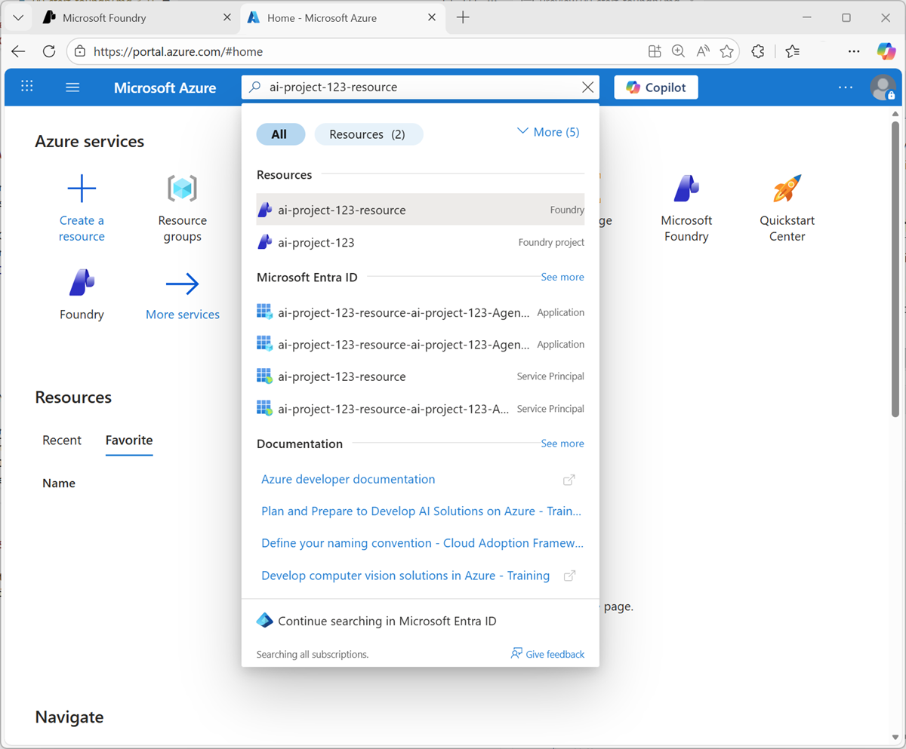
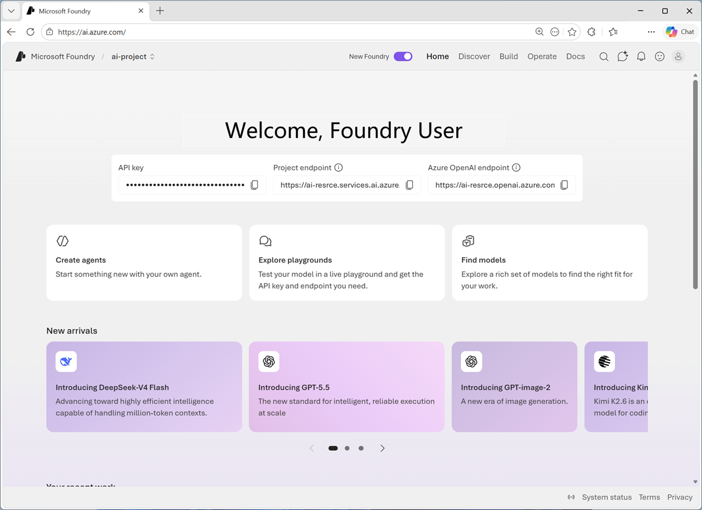
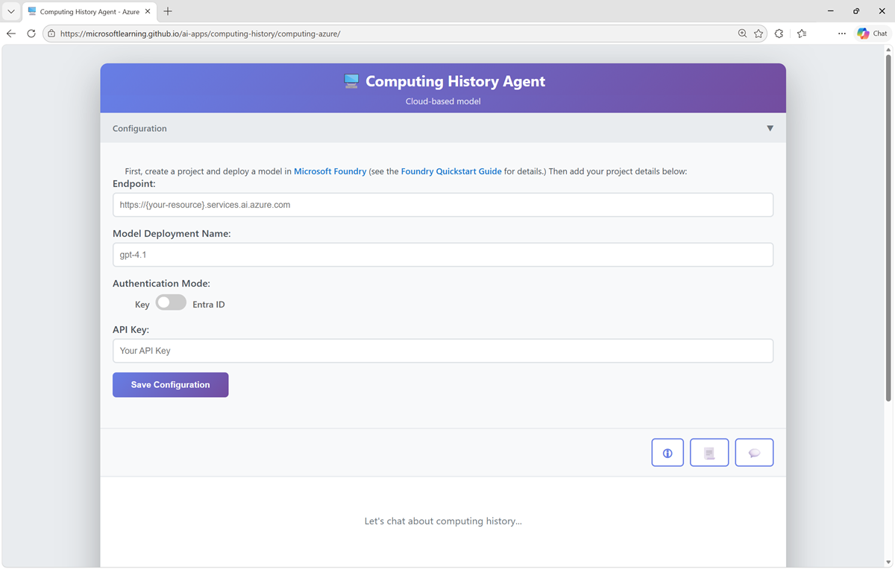

# **Get started with AI in Azure:-**

### **Core Azure services:-**

1. Compute — rent scalable virtual machines and compute resources to run applications and AI workloads.

2. Storage — persist files, databases, images, backups, and other data in managed cloud storage.

3. Networking — connect resources securely and efficiently across the cloud, internet, and on‑premises networks.

4. App Services — managed platforms for building, hosting, and running apps without managing underlying servers.

### **Azure organizational structure and purpose:-**

1. Tenant — an organization’s identity boundary in Azure; contains users, groups, and policies.

2. Subscription — billing and quota container; ties usage to payment and sets cost/usage boundaries.

3. Resource group — a logical folder for related resources to simplify management, permissions, and automation.

4. Resource — any individual service instance (storage account, database, VM) with type, configuration, region, and access controls.

5. Key governance points — choose region, performance tier, and permissions when creating resources to control cost, latency, and security.

### **Azure portal and programmatic management:-**

1. Azure portal — centralized web UI to create, configure, monitor, and manage resources, view billing, and access specialized services.

2. Programmatic creation — use Azure CLI, SDKs, or scripts to automate deployments and ensure repeatability for larger AI systems.

3. Monitoring and cost control — portal and APIs let you monitor usage, set policies, and manage spending across subscriptions and resource groups.

#### **Why this matters for AI solutions:-**

1. Scalability — Azure lets you scale compute and storage to match AI training and inference needs.

2. Governance — tenants, subscriptions, and resource groups enable secure separation of environments (dev/test/prod) and cost allocation.

3. Automation — programmatic provisioning supports reproducible deployments for models, data pipelines, and production services.

#### **Pillars for developing AI Apps:-**

Azure provides the infrastructure and services needed to build, secure, scale, and operate AI applications using familiar tools and managed services so teams can move from prototype to production quickly.

1. **Security and networking**

    a. Identity and access control: Use Azure Entra ID and role‑based access control to ensure only authorized users and services access AI resources.

    b. Secret management: Store keys and secrets (API keys, connection strings, tokens) in Azure Key Vault and retrieve them securely at runtime (for example via managed identities).

    c. Threat detection and isolation: Apply network isolation, firewalls, monitoring, and compliance controls to protect models, data, and endpoints.

2. **Hosting and scaling**

    a. Hosts and runtimes: Run AI workloads on VMs, container platforms, or managed services such as Azure Kubernetes Service (AKS) and Azure App Service.

    b. Scaling patterns: Scale out (add instances) or scale up (increase resources per instance); Azure supports autoscaling based on CPU, request load, or custom metrics.

3. **Data storage and types**

    a. Multiple data roles: Distinguish training data, inference input, model outputs, application state, configuration, logs/telemetry, and security/access data.

    b. Storage options: Choose managed services to match needs—examples include Azure SQL Database, Azure Cosmos DB, and Azure Database for PostgreSQL—to provide persistence, global distribution, and transactional guarantees.

4. **AI capabilities and operations**

    a. Platform tooling: Use enterprise platforms such as Microsoft Foundry to develop, operate, and govern AI agents and solutions on Azure.

    b. Automation and management: Provision and manage resources via the Azure portal, CLI, SDKs, or templates to enable repeatable deployments and operational control.

### **Microsoft Foundry for AI:-**

Microsoft Foundry is an enterprise PaaS that consolidates model hosting, agent orchestration, monitoring, and governance to build, deploy, and operate AI applications at scale.

**Core components (what to remember):-**

1. Models — A unified model catalog with first‑party, partner, OpenAI‑compatible, and open‑source models; supports evaluation, deployment types (standard, provisioned, batch), versioning, and Responsible AI controls.

2. Agents — Agent‑first design: agents can reason, call tools, access data, and automate workflows; Foundry handles orchestration, safety, and observability so developers focus on agent goals. Using either low‑code or code‑first workflows, teams can create multi‑agent systems that work with project resources such as documents, datasets, search indexes, and connections to external systems, including integrations like Azure Functions or Microsoft Fabric.

3. Tools — Built‑in AI services (vision, language, speech, document intelligence) that you can plug into agents or apps. For example, you could use Azure Vision to analyze images, Azure Language to summarize text, classify information, or extract key phrases, and Azure Speech to convert speech to text and text to speech.

4. Knowledge (Foundry IQ) — A permission‑aware knowledge layer that indexes internal/external sources, and automatically handles indexing, document chunking, vector embeddings, and metadata extraction., Foundry IQ uses agentic retrieval to break the question into subqueries, search multiple sources in parallel, and return relevant,citation‑backed results while enforcing permissions and sensitivity labels which ensures user has permission to access or see information retrieved.

**Foundry resources, projects, and workflow:-**

1. Foundary Resource :- This is the starting point in Azure Foundry. You might have one Foundry resource for a team or department, and many Foundry projects inside it, each focused on a separate AI use case. It is an Azure resource that needs to be created which provides access to :-

        a. Models (Microsoft, partner, and OpenAI‑compatible)
        b. Foundry’s agent service
        c. Deployment governance
        d. Monitoring \& observability
        e. Security boundaries
        f. Quotas and operational controls

2. Foundry project :- is a workspace inside that resource where you build AI apps, agents, and evaluations. A Foundry Project lets you build and manage:

        a. Agents
        b. Evaluations
        c. Files and datasets
        d. Vector indexes
        e. Flows (AI logic)
        f. Connections
        g. Project‑specific settings

3. Typical workflow: create a Foundry project → pick and deploy a model from the catalog → experiment in the Playground → integrate the model into a client app (client formats input, server/model runs inference, returns output).

example workflow :-

1. **Sign into Foundry portal using your Azure subscription and create a Foundry project.**
2. **In Foundry, pick a model from the Model Catalog and deploy it.**
3. **In Foundry, experiment with the model in the Playground. You can use the Playground to write prompts, test model responses, configure parameters.**
4. **Use the configured model in your own client application.**

### **Microsoft Foundry endpoints:-**

**What an endpoint is:-**

Endpoint = service entry point (HTTP address) that client applications call to use Foundry models and project APIs.

example:- https://<foundry-project>-resource.cognitiveservices.azure.com/openai/deployments/gpt-4o/chat/completions?api-version=2024-05-01-preview

**Types of endpoints:-**

1. Project‑level endpoints — interact with your Foundry project and its resources.

2. Model endpoints — send prompts to deployed models (example URL pattern shown).

**Security and access:-**

Endpoints are protected: callers must present the correct API key or a valid Microsoft Entra ID token (authentication is required to access model endpoints).

#### **Exercise:-**

1. In a web browser, open Microsoft Foundry at https://ai.azure.com and sign in using your Azure credentials

2. If it is not already enabled, in the tool bar the top of the page, enable the New Foundry option. Then, if prompted, create a new project with a unique name; expanding the Advanced options area to specify the following settings for your project:

        a. Foundry resource: Enter a valid name for your AI Foundry resource.
        b. Subscription: Your Azure subscription
        c. Resource group: Create or select a resource group
        d. Region: Select any of the AI Foundry recommended regions in this list

3. Select Create. Wait for your project to be created.

4. Microsoft Foundry projects are based on resources in your Azure subscription. Let’s take a look at those. On the project home page, in the toolbar at the top left, select your project name. Then in the resulting menu, select View all projects to see all of the projects to which you have access (you may only have one!). Each project has a parent resource, in which services and configuration can be applied to multiple child projects.

5. In the Azure portal home page, in the search box at the top of the page, search for your Microsoft Foundry parent resource.

    

6. Select the Foundry resource that matches your parent resource name to open it.

7. In the page for your Foundry resource, view the Resource Visualizer page to see the relationship between the resource and its child project(s).

    

8. Select the child project you created in this resource to open its page in the Azure portal.

    

9. View the Home page for your project. The project has an API key, Project endpoint, and Azure OpenAI endpoint, which can be used to securely access models, agents, and other assets in the project from client applications.

    

10. View the Discover page. This page surfaces the latest models and services and enables you to find starting points for AI application development.

    

11. View the Build page.
    a. View and manage the agents and workflows in your project.
    b. View and manage the models in your project.
    c. Fine-tune base models to respond to queries based on your application’s specific needs.
    d. Add and configure tools that agents can use to perform tasks.
    e. Manage knowledge for your agents based on Foundry IQ data sources in your enterprise.
    f. Connect and manage data indexes for AI agents and generative AI apps.
    g. Create evaluations to compare model performance.
    h. Define and manage guardrails to ensure compliance with responsible AI policies for generative AI content and behavior.

    

12. View the Operate page.

    a. Managing assets like agents, models, and tools in your project.
    b. Manage compliance with security policies.
    c. View and manage quota configuration that defines limits for usage of models and other assets in your project.
    d. Perform admin tasks to manage your projects.

    

13. View the Docs page. This page provides access to Microsoft Foundry documentation.

14. In the toolbar, use the AI chat icon to open the Ask AI pane.

##### **Deploy Model**

15. Your Microsoft Foundry resource provides an endpoint in which you can deploy models and use them from applications and agents. On the Discover page, select the Models tab to view the Microsoft Foundry model catalog.

    

16. Search for and select the gpt-4.1-mini model, and view the page for this model, which describes its features and capabilities.

17. Use the Deploy button to deploy the model using the default settings. Deployment may take a minute or so.

    

18. When the model has been deployed, view the model playground page that is opened, in which you can chat with the model.

19. Ensure your model deployment (which should be named gpt-4.1-mini) is selected in the playground. In the Chat pane, test your model by entering a message

    

##### **Use model via Foundary resourse endpoint**

20. Select Home from menu at top to return to the home page. Note the following details for your project:
    a. Project endpoint: The URL where your project resource can be accessed.

    b. Project API key: The authentication key used to access your resource*.

21. Open a second browser tab, and navigate to the Computing History Agent app at [https://aka.ms/computing-history-foundry].
The Computing History app should open with its Configuration panel

    

22. Enter your project endpoint, model deployment name, and API key from the Foundry portal into the configuration settings, and save the configuration. The app will use your deployed model in Microsoft Foundry. And you can start conversation

example prompt:-

    a. Who was Ada Lovelace?
    b. Tell me more about her work with Charles Babbage.
    c. Tell me about the ELIZA chatbot.
    d. How does it compare to modern large language models?
    e. Find a vintage computer store in Seattle.
    f. Search for classic Microsoft logos.

23. you try speech recognition by using audio input button and asking the question via speech. Upload or attach images via attachment icon and ask questions around or gather info from the image like "Extract the text from this printed circuit board, and search for information that might help identify the computer it came from."