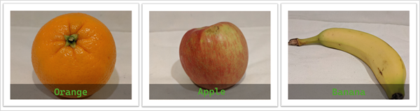
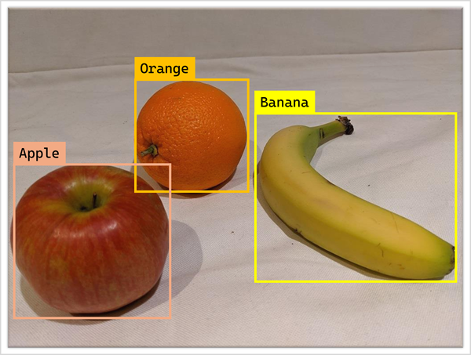
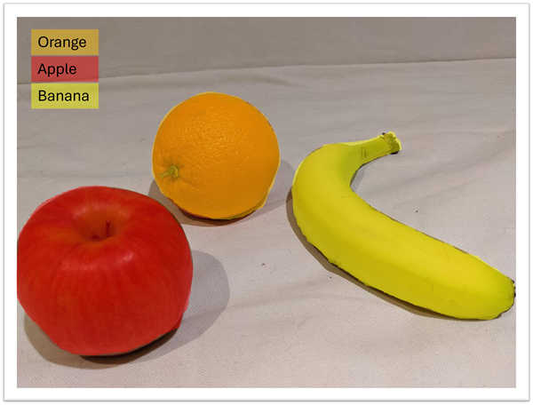
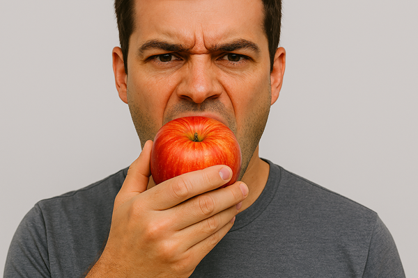
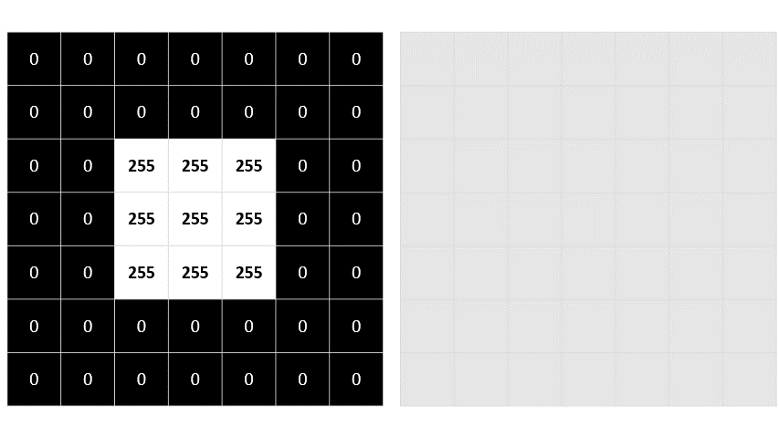
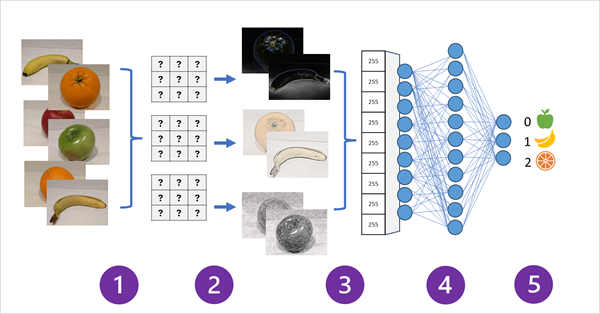

# 📘 Introduction to Computer Vision Concepts

Computer vision is the set of AI tasks and techniques that let software process visual input from images, video, or live camera streams to extract meaningful information.

---

## 🔎 Use Cases of Computer Vision

1. **Image classification** — Predict a single label that describes the main subject of an image.  
   _Example:_ Identify each item in a grocery store during checkout.
   

2. **Object detection** — Find multiple objects and their locations in an image; outputs object classes plus bounding boxes.  
   _Example:_ Identify different items when a group of groceries is placed in front of a camera. Identify the cars, buildings, signboards, traffic signal in self driving car.
   

3. **Semantic segmentation** — Classify each pixel so the model produces precise object shapes and boundaries.  
   _Example:_ Identify the shape and size of fruits by pixel and classify them.
   

4. **Contextual image analysis (multimodal models)** — Link image content with text to interpret scenes, describe activities, or suggest tags.
   
   - **A man eating an apple**

---

## 🖼️ Images and Image Processing

### 1. Image Representation

- **Pixels and resolution** — An image is a 2D array of pixel values; resolution = rows × columns.
- **Grayscale vs color** — Grayscale uses a single channel (0–255); color images use three channels (RGB).

### 2. Color Channels

- **RGB channels** — Each pixel’s final color = R, G, B values (e.g., purple = R:150, G:0, B:255).
- **Interpretation** — Channels treated as stacked 2D arrays; many vision models accept multi‑channel tensors.

### 3. Filters and Kernels

- **Filter kernel** — A small matrix (e.g., 3×3) of weights used to transform local patches.
- **Common effects** — Blurring, sharpening, color inversion, edge highlighting (e.g., Laplace filter).
- 
- Because the filter is convolved across the image, this kind of image manipulation is often referred to as convolutional filtering. The filter used in this example is a particular type of filter (called a Laplace filter) that highlights the edges on objects in an image.

<figure style="display:inline-block; text-align:center; margin:10px;">
   <figcaption>Gray scale image</figcaption>
  
  
</figure> 
<figure style="display:inline-block; text-align:center; margin:10px;">
  <figcaption>Filtered Image</figcaption>
  
</figure>

### 4. Convolution Process

- **How it works** — Slide kernel across image; compute weighted sum of pixel × kernel weight.
- **Value range and clipping** — Results clipped back into 0–255 range.
- **Padding and borders** — Edges require padding (commonly zeros).

---

## 🧠 Convolutional Neural Networks (CNNs)

CNNs are deep learning architectures that use learnable filters to extract feature maps from images and classify them.

### How a CNN Processes Images

1. **Input and filters** — Convolutional layers apply kernels to produce feature maps.
2. **Downsampling** — Pooling reduces feature map size and emphasizes key features.
3. **Flattening and classification** — Feature maps flattened → fully connected layers → softmax output.

### Training Process

1. **Initialization** — Filter weights start randomly.
2. **Loss and backpropagation** — Loss computed vs true labels; gradients update weights.
3. **Model saving and inference** — Trained weights saved and used for predictions.

## 

## 🔄 Vision Transformers and Multimodal Models

Transformers, originally for language, encode tokens as embeddings using attention. Applied to images, they enable **Vision Transformers (ViT)** and multimodal models.

### 1. How Transformers Encode Semantics

- **Token embeddings** — Convert tokens into high‑dimensional vectors.
- **Attention mechanism** — Models relationships between tokens.

### 2. Vision Transformers (ViT)

- **Patch tokens** — Images split into patches → flattened → embeddings.
- **Visual embeddings** — Capture attributes like color, shape, texture, co‑occurrence.

### 3. Multimodal Models

- **Combining encoders** — Language + vision encoders aligned via cross‑attention.
- **Capabilities** — Generate descriptions, match images to text, reason about visual–textual relationships.

---

## 🎨 Image Generation

Modern image generation uses multimodal models to map text prompts → visual features → synthesized images.

### How Generation Works

- **Iterative denoising (diffusion)** — Start with random pixels, iteratively remove noise guided by prompt.
- **Evaluation loop** — At each step, compare intermediate image to prompt and refine.

### Key Model Concepts

- **Prompt → visual features** — Identify attributes implied by text.
- **Evaluation loop** — Adjust generation at each denoising step.

### Video Generation Differences

- **Temporal and physical consistency** — Enforce coherence across frames and realistic motion (e.g., object contact with ground).
